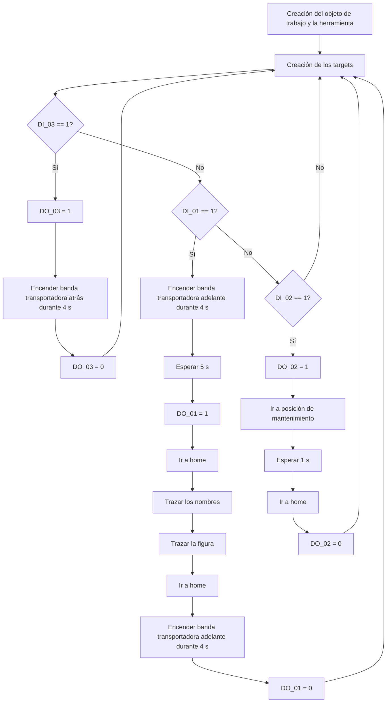

<div align="center">
<h3>Curso de Robótica 2026-I</h3>

<h1>Desarrollo Laboratorio No.1 </h1>
<h2> Robótica Industrial: Trayectorias, entradas y salidas digitales. </h2>

<h3>Profesores: Pedro Fabián Cárdenas Herrera <br> Manuel Felipe Carranza Montenegro</h3>

<h3>Estudiantes: Juan Diego Sáenz Ardila <br> Alejandra Sofia Monroy Socha <br> </h3>

</div>

---

## 1. Introducción al problema y descripción de la solución planteada 

### 1.1 Planteamiento del problema

En este laboratorio se aborda el desarrollo de un sistema automatizado con el manipulador ABB IRB 140 para la decoración de una torta mediante un robot industrial, con el propósito de sustituir un proceso manual por uno programado que garantice mayor precisión, repetibilidad y control. El problema consiste en lograr que el robot ejecute trayectorias sobre una superficie plana que representa una torta virtual, en la cual se deben escribir los nombres de los integrantes del equipo y realizar una figura decorativa adicional.

Adicionalmente, el sistema debe integrar el control de una banda transportadora a través del uso de entradas y salidas digitales, y el diseño de una herramienta adecuada para realizar la decoración, de manera que todos los componentes funcionen de forma coordinada.

El desarrollo de la solución está sujeto a las siguientes especificaciones y restricciones:

- La torta está dimensionada para aproximadamente 20 personas, lo que define el área de trabajo.
- Los nombres de los integrantes deben ser legibles y estar separados dentro de la superficie.
- La decoración debe incluir al menos una figura adicional.
- Las trayectorias deben ejecutarse dentro de un rango de velocidades entre 100 y 1000.
- Se debe cumplir una tolerancia máxima de error en la posición de z10 mm.
- El movimiento debe realizarse como un trazo continuo.
- El proceso debe iniciar y finalizar en la misma posición *home*.

### 1.2 Solución del problema

La solución se desarrolló de manera progresiva, teniendo como primer acercamiento el entorno virtual y luego el físico. Los pasos con los que se dió solución al problema y su respectiva descripción se muestran a continuación.

#### a. Definición de la herramienta
Inicialmente, se consultó el datasheet del robot con el fin de identificar las especificaciones del flange (dimensiones y forma de ajuste), para luego realizar el modelado CAD de la herramienta en Autodesk Inventor. Este diseño incorporó consideraciones de orientadas a su fabricación mediante manufactura aditiva.
> El diseño detallado de la herramienta se presenta en una sección posterior.

#### b. Caracterización del entorno de trabajo
Con el fin de definir un sistema coherente entre el entorno real y la simulación se realizaron las siguientes mediciones en el laboratorio:
- Posición y dimensiones de la banda transportadora.
- Distancia entre el robot y la zona de trabajo.

#### c. Modelado del objeto de trabajo.
Con la zona de trabajo definida se modeló el pastel considerando: 
- La distribución espacial de los nombres.
- La creación de la figura decorativa.

El plano del resultado final es: 
<div align="center">

</div>
> Este modelado se utilizó como guía para la generación de trayectorias del robot.

#### d. Simulación y configuración en RobotStudio
En el entorno de sumulación se realizó el siguiente procedimiento: 
- Carga del robot y la herramienta diseñada.
- Definición del TCP (Tool Center Point).
- Creación de workobject virtual.

Finalmente, se programaron las trayectorias necesarias para: 
- Inicio de la rutina en *home*.
- Escritura de los nombres de los integrantes.
- Ejecución de la figura decorativa (corazón).
- Retorno a la posición *home*.

#### e. Integración del sistema

Se integraron los distintos componentes del sistema, buscando la coordinación entre el robot y la banda transportadora mediante el uso de señales digitales.

Para el control de la banda, se implementó una lógica basada en entradas y salidas digitales (DI/DO), las cuales fueron previamente definidas tanto en el controlador como en el entorno de simulación de RobotStudio. Esto permitió disponer de una consola de simulación desde la cual se podían activar y monitorear las señales, facilitando la validación del comportamiento del sistema antes de su ejecución física.

Dado que no se contaba con un perfil caracterizado de velocidades de la banda transportadora, la sincronización del sistema no se realizó en función de velocidad, sino mediante parámetros temporales. Se definieron:

- Tiempos de activación de la banda (encendido/apagado).
- Tiempos de espera entre la llegada de un pastel y el siguiente.
- Tiempos de espera asociados a la ejecución del robot.

Adicionalmente, se implementó la lógica de ejecución del sistema mediante condiciones sobre las entradas digitales, así como una rutina de posición de mantenimiento, permitiendo llevar el robot a una configuración dónde el cambio de herramienta se dé fácilmente. Las entradas digitales se daban al sistema físico en forma de botones y las salidas eran el encendido y apagado de luces. 

#### f. Implementación y pruebas en laboratorio

Una vez validado el sistema en el entorno de simulación, se procedió a su implementación en el laboratorio, con el objetivo de verificar la correspondencia entre el modelo virtual y el comportamiento físico del sistema.

En esta etapa se realizó la calibración experimental del TCP utilizando la herramienta física. Sin embargo, esta calibración presentó un error aproximado de **6 mm**, atribuible a imprecisiones en el proceso de medición y alineación. Debido a esto, para la ejecución final se optó por utilizar el TCP virtual, el cual presentaba error nulo con un modelado casi exacto de la herramienta real.

Por otro lado, se definió también workobject en el entorno real. A diferencia del TCP, en este caso se decidió trabajar con el workobject real ya que la banda transportadora en el laboratorio no coincidía exactamente con la representada en el simulador.

Durante las pruebas experimentales se ajustaron parámetros como:

- Tiempos de activación de la banda transportadora.
- Tiempos de espera entre ciclos.
- Sistemas coordenados del objeto de trabajo y la mejor ubicación según el tipo de acercamiento del robot. 

>  El resultado final del sistema se presenta en la sección de videos más adelante.

## 2. Diagrama de flujo de acciones del robot

## 3. Plano de planta 

<div align="center">

</div>


## 4. Descripción de las funciones utilizadas 

Dentro de las trayectorias definidas en el programa RAPID, se emplean diversas instrucciones fundamentales para controlar el movimiento del robot y la interacción con el entorno.

A continuación, se describen las principales funciones utilizadas:

### 4.1. Funciones de movimiento 

#### 🔹 MoveJ

La instrucción `MoveJ` permite realizar un movimiento articular del robot. En este tipo de movimiento, cada eje se desplaza de forma independiente hasta alcanzar la posición objetivo.

Este fue utilizado para cuando la trayectoria no importaba, como alejar la herramienta del workobject, moverse a home y moverse a la posición de mantenimiento.

```rapid
MoveJ C1_1, v100, z10, Marcador\WObj:=Pastel;
```
- *C1_1*: representa el punto al que se debe dirigir el robot.  
- *v100*: representa la velocidad del TCP en mm/s.  
- *z10*: representa la zona de aproximación (incertidumbre) en mm.  
- *Marcador\\WObj:=Pastel*:  
  - *Marcador*: define la herramienta (TCP y orientación).  
  - `\\`: separador entre la herramienta y el WorkObject.  
  - *WObj:=Pastel*: define el sistema de coordenadas del entorno (WorkObject).


#### 🔹 MoveL

La instrucción `MoveL` ejecuta un movimiento lineal, asegurando que el efector final del robot se desplace en línea recta entre dos puntos. Esta función se utilizo para las lineas rectas del dibujo.

```rapid
MoveL C1_2, v100, z10, Marcador\WObj:=Pastel;
```
La sintaxis de la función es igual a MoveJ.

#### 🔹 MoveC

La instrucción `MoveC` permite realizar un movimiento circular, definido mediante un punto intermedio y un punto final (el punto inicial se toma como el actual) .Esta función se utilizo para las curvas del dibujo.

```rapid
MoveC C1_3, C1_4, v100, z10, Marcador\WObj:=Pastel;
```
La sintaxis de la función es similar a MoveJ, con la aclaración de que el primer punto es el punto intermedio y el otro punto es el punto final.
### 4.2. Funciones de control 
#### 🔹 Set

La instrucción `Set` se utiliza para activar una señal digital de salida.

En el laboratorio se utilizaron para encender luces que mostraban que función se estaba ejecutando y también se utilizaba para encender la banda transportadora en un sentido.
```rapid
Set DO_03;
```


#### 🔹 Reset

La instrucción `Reset` permite desactivar una señal digital de salida previamente activada.

Se utilizó para apagar la banda transportadora y las luces del panel de control.

```rapid
Reset DO_03;
```


#### 🔹 WaitTime

La instrucción `WaitTime` introduce una pausa en la ejecución del programa, deteniendo temporalmente el robot durante un tiempo específico (en segundos).

Este fue utilizado para poder fijar la traslación del objeto de trabajo en la banda transportadora, pues se esperaba un número de segundos para apagar la banda.

```rapid
WaitTime 2;
```


Estas funciones constituyen la base del control de movimiento y lógica del robot dentro del entorno de RobotStudio, permitiendo ejecutar trayectorias precisas y coordinar acciones con elementos externos del sistema.
## 5. Diseño de la herramienta detallado 
<div align="center">

</div>


## 6. Código de RAPID

El programa de RAPID puede consultarse aquí: 
[Ver Module1](./Código_RAPID.MD)

La estructura que sigue el código es la siguiente: 

### 6.1. Creación del módulo

El programa está contenido dentro de un módulo RAPID:

```python
MODULE Module1
```

### 6.2. Definición de herramienta y WorkObject

Se definen los datos persistentes de la herramienta y el objeto de trabajo:

- tooldata (`Marcador`): representa la herramienta activa del robot.
- wobjdata (`Pastel`): define el sistema de referencia sobre el cual se ejecutan las trayectorias.

### 6.3. Definición de puntos

Se utilizan múltiples variables de tipo `robtarget`, por ejemplo:

```python
CONST robtarget C1_1 := [...];
```
Estos puntos están organizados y nombrados en el orden en el que se usan en cada trayectoria. 

### 6.4. Procedimiento condicionado a entradas digitales

```python
PROC main()
```

Este procedimiento contiene un bucle infinito (`WHILE TRUE`) que responde a entradas digitales:

- DI_01: ejecuta la secuencia completa de trayectorias al pastel.
- DI_02: envía el robot a posición de mantenimiento.
- DI_03: activa el control de la banda transportadora. 

### 6.5. Definición de trayectorias (Paths)

Cada trayectoria se define en procedimientos independientes:

```python
PROC Path_A_1()
PROC Path_L()
PROC Path_E()
```
> Dentro de estas trayectorias se utilizan las funciones descritas en la sección 4.

En cuanto a los parámetros de movimiento:

- Se estableció una velocidad constante de v100 para toda la ejecución según el requerimiento.
- Se utilizó zona z10 como valor general para suavizar trayectorias y evitar paradas innecesarias segpun el requerimiento.

Sin embargo, en puntos específicos donde la geometría genera cambios bruscos de dirección (por ejemplo, esquinas pronunciadas como la punta del corazón), el robot presentaba errores de trayectoria de esquina al usar z10. Para corregir esto, en esos casos puntuales se redujo la zona a z1, obligando al robot a pasar más cerca del punto y garantizar la precisión del trazo.

## 7. Video simulación en RobotStudio
A continuación se presenta el link del video de youtube donde se encuentra el video: [Video simulación en RobotStudio](https://youtu.be/7ArkRfWwZoY)

## 8. Video resultado final Laboratorio 1


