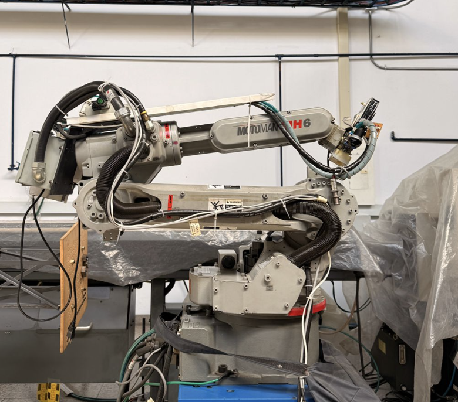
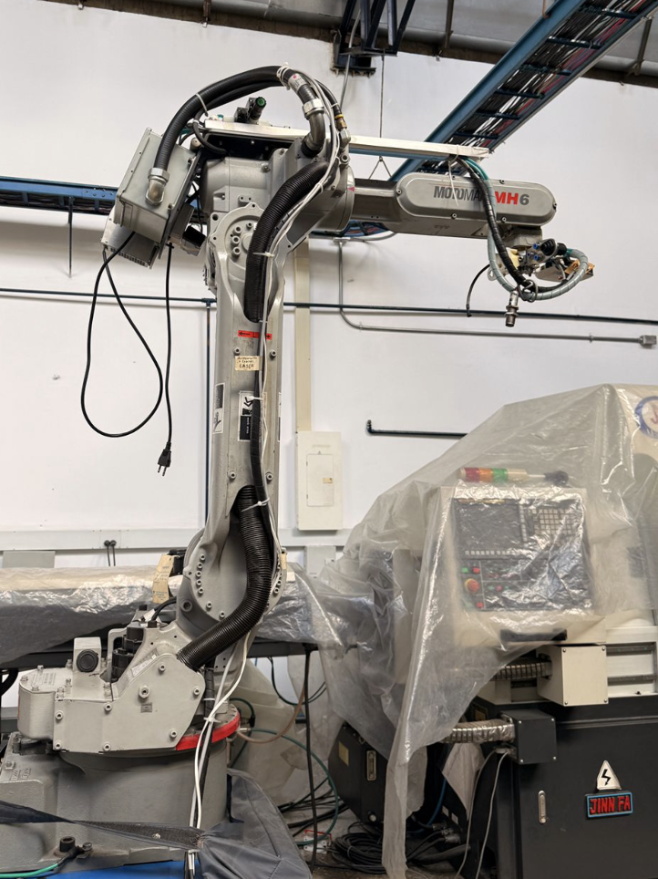

<h3>Curso de Robótica 2026-I</h3>

<h1>Desarrollo Laboratorio No.2 </h1>
<h2> Robótica Industrial - Análisis y Operación del Manipulador Motoman MH6. </h2>

<h3>Profesores: Pedro Fabián Cárdenas Herrera   Manuel Felipe Carranza Montenegro</h3>

<h3>Estudiantes: Juan Diego Sáenz Ardila   Alejandra Sofia Monroy Socha   </h3>

---

## 1. Cuadro Comparativo: Motoman MH6 vs. ABB IRB 140. 

| Característica Técnica | Motoman MH6 | ABB IRB 140 |
|---|---|---|
| **Carga Máxima (Payload)** | 6 kg | 6 kg |
| **Alcance Horizontal** | 1422 mm | 800 mm |
| **Alcance Vertical** | 2486 mm | 810 mm (altura del brazo) |
| **Grados de Libertad** | 6 ejes ( 8 con las articulaciones extras especificas del trabajado en este laboratorio) | 6 ejes |
| **Repetibilidad** | ±0.08 mm | ±0.03 mm |
| **Velocidad Máxima (Eje 1)** | 220°/s | 200°/s |
| **Velocidad Máxima (Eje 2)** | 200°/s | 200°/s |
| **Velocidad Máxima (Eje 3)** | 220°/s | 260°/s |
| **Velocidad Máxima (Eje 4)** | 410°/s | 360°/s |
| **Velocidad Máxima (Eje 5)** | 410°/s | 360°/s |
| **Velocidad Máxima (Eje 6)** | 610°/s | 450°/s |
| **Masa del Manipulador** | 130 kg | 98 kg |
| **Montaje** | Suelo, pared, techo | Suelo, invertido, pared (cualquier ángulo) |
| **Controlador** | DX100 | IRC5 |
| **Protección Estándar** | No especificado explícitamente | IP67 (toda la unidad) |
| **Aplicaciones Típicas** | Ensamble, soldadura (arco/punto), empaque, corte, manipulación de materiales | Industrias manufactureras, fundición, sala blanca, pegado, soldadura, carga/descarga |

---

## 2. Descripción de las configuraciones home1 y home2 del Motoman MH6. 

### 2.1 Configuración Home 1 (Posición de transporte)

 
Esta posición corresponde a una configuración de reposo, transporte o almacenamiento del robot, donde el manipulador permanece contraído para minimizar el espacio ocupado y reducir esfuerzos mecánicos sobre los actuadores. Los valores articulares observados en el Teach Pendant son: 

| Eje | Origin | Current |
|---|---|---|
| S | 0 | -1 |
| L | -115290 | -115290 |
| U | -111622 | -111621 |
| R | 1 | 1 |
| B | 42647 | 42646 |
| T | 1392 | 1392 |

### 2.2 Configuración Home 2 (Posición de operación)

 
Esta configuración corresponde a la posición de referencia mecánica utilizada para calibración, sincronización y verificación de alineación de los ejes del robot. Los valores articulares observados en el Teach Pendant son: 

| Eje | Specified | Current | Difference |
|---|---|---|---|
| S | 0 | 0 | 0 |
| L | 2037 | 2037 | 0 |
| U | 2359 | 2359 | 0 |
| R | 0 | 0 | 0 |
| B | -121 | -121 | 0 |
| T | 1392 | 1392 | 0 |

### ¿Cuál configuración es mejor?

En operación industrial, la configuración **Home 1** suele ser la más conveniente como posición de reposo. Al mantener el robot compacto, reduce el espacio ocupado, disminuye el riesgo de colisiones y genera menor esfuerzo sobre los ejes principales mientras el robot está detenido.

Por otro lado, la configuración **Home 2** es más útil para calibración y programación, ya que facilita la verificación visual de la alineación de los ejes y la referencia mecánica del manipulador.

## 3. Proceso para realizar movimientos manuales.

## 4. Explicación sobre los niveles de velocidad. 

## 5. Descripción funcionalidades RoboDK, comunicación con el manipulador Motoman y procesos de ejecución de movimiento. 

## 6. Comparación entre RoboDK y RobotStudio. 

## 7. Diagrama de flujo de acciones del robot. 

## 8. Plano de planta del robot. 

## 9. Código de RoboDK. 

## 10. Video resultado final Laboratorio 2. 

## Gracias 

