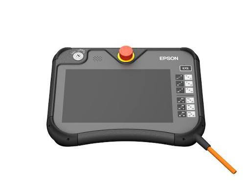
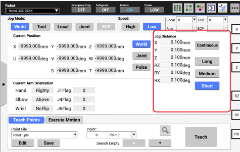
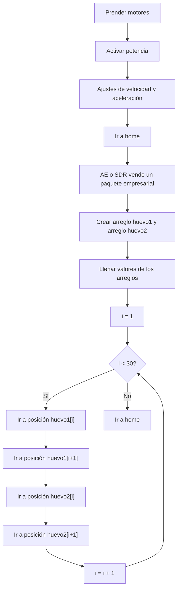

<div align="center">
<h3>Curso de Robótica 2026-I</h3>

<h1>Desarrollo Laboratorio No.3 </h1>
<h2> Operación, Análisis del Manipulador EPSON T3-401S </h2>

<h3>Profesores: Pedro Fabián Cárdenas Herrera <br> Manuel Felipe Carranza Montenegro</h3>

<h3>Estudiantes: Juan Diego Sáenz Ardila <br> Alejandra Sofia Monroy Socha <br> </h3>

</div>

## 1. Cuadro Comparativo: Motoman MH6, IRB140 y EPSON T3-401S 

| Característica Técnica | Motoman MH6 | ABB IRB 140 | Epson T3-401S |
|------------------------|-------------|-------------|---------------|
| Carga Máxima (Payload) | 6 kg | 6 kg | 3 kg |
| Alcance Horizontal | 1422 mm | 800 mm | 400 mm |
| Alcance Vertical | 2486 mm | 810 mm | 150 mm (eje Z) |
| Grados de Libertad | 6 ejes (8 con articulaciones extras del laboratorio) | 6 ejes | 4 ejes|
| Repetibilidad | ±0.08 mm | ±0.03 mm | ±0.02 mm(J1-J2-J3) , ±0.02° (J4) |
| Velocidad Máxima (Eje 1) | 220°/s | 200°/s | 3700 mm/s |
| Velocidad Máxima (Eje 2) | 200°/s | 200°/s | 3700 mm/s|
| Velocidad Máxima (Eje 3) | 220°/s | 260°/s | 1000 mm/s |
| Velocidad Máxima (Eje 4) | 410°/s | 360°/s | 2600°/s |
| Velocidad Máxima (Eje 5) | 410°/s | 360°/s | No aplica |
| Velocidad Máxima (Eje 6) | 610°/s | 450°/s | No aplica |
| Masa del Manipulador | 130 kg | 98 kg | 16 kg |
| Montaje | Suelo, pared, techo | Suelo, invertido, pared (cualquier ángulo) | Mesa (Tabletop) |
| Controlador | DX100 | IRC5 | RC90B |
| Protección Estándar | No especificado explícitamente | IP67 (toda la unidad) | CE Mark, EMC directive, Machinery directive, RoHS directive , ANSI/RIA R15.06-2021, NFPA 79 (Edición 2007) |
| Aplicaciones Típicas | Ensamble, soldadura (arco/punto), empaque, corte, manipulación de materiales | Manufactura, fundición, sala blanca, pegado, soldadura, carga/descarga | Ensamble, pick-and-place, manipulación de materiales, empaque, palletizado, inspección y pruebas |

## 2. Descripción de las configuraciones Home del EPSON T3-401S. 

Durante la práctica de laboratorio con el robot SCARA EPSON T3-401S se identificaron dos configuraciones Home diferentes:

### 2.1. Home 1 (predeterminado)

<div align="center">

</div>

En la configuración predeterminada del fabricante, las articulaciones se encuentran en la siguiente posición:

<div align="center">

| Articulación | Valor | Pulsos |
| ------------ | ----- | ------ |
| J1           | 0°    | 0      |
| J2           | 0°    | 0      |
| J3           | 0 mm  | 0      |
| J4           | 0°    | 0      |

</div>

En esta condición, el primer eje rotacional (J1) orienta el robot hacia la dirección correspondiente al eje X del sistema de referencia utilizado por el fabricante.


### 2.2. Home 2 (Laboratorio)

<div align="center">

</div>

Durante las prácticas de laboratorio se utiliza una configuración alternativa en la cual la articulación J1 se encuentra desplazada 90° respecto a la configuración original.

Los valores observados son:

<div align="center">

| Articulación | Valor | Pulsos |
| ------------ | ----- | ------ |
| J1           | 90°   | 204800 |
| J2           | 0°    | 0      |
| J3           | 0 mm  | 0      |
| J4           | 0°    | 0      |

</div>

Esta modificación orienta el robot hacia la dirección correspondiente al eje Y del sistema de trabajo.
La principal razón para utilizar una configuración Home con J1 = 90° es la adaptación del robot al entorno físico donde opera.

En la celda de trabajo del laboratorio, la orientación hacia el eje Y permite que el volumen de trabajo útil quede mejor alineado con la disposición de la mesa y de los elementos de manipulación. De esta manera, el robot inicia su operación apuntando directamente hacia la zona donde se realizan la mayoría de las tareas. Es importante destacar que la modificación del Home 2 no altera los límites mecánicos reales del robot. El robot conserva la misma capacidad física de movimiento, ya que únicamente se modifica el punto de referencia desde el cual se miden las posiciones articulares.

## 3. Proceso para realizar movimientos manuales.

### 3.1 Cambio al modo de enseñanza

<div align="center">

</div>

1. Colocar el selector del Teach Pendant TP3 en modo `TEACH/T1`.
2. Acceder a la ventana `Jog & Teach`.
3. Verificar que el robot se encuentre habilitado para realizar movimientos manuales.

### 3.2 Selección del modo de operación

Dentro de la ventana `Jog & Teach`, en la opción `Mode`, seleccionar el sistema de coordenadas deseado:

| Modo | Descripción |
|--------|-------------|
| Joint | Movimiento individual de las articulaciones J1, J2, J3 y J4. |
| World | Movimiento cartesiano respecto al sistema de coordenadas global. |
| Tool | Movimiento cartesiano respecto al sistema de coordenadas de la herramienta. |
| Local | Movimiento cartesiano respecto al sistema de coordenadas local. |
| ECP | Movimiento respecto al punto central efectivo de la herramienta. |

### 3.3 Configuración de la distancia de desplazamiento

<div align="center">

</div> 
En la sección `Jog Distance` se puede seleccionar:

| Opción | Descripción |
|---------|-------------|
| Continuous | El robot se mueve mientras se mantenga presionado el botón de desplazamiento. |
| Long | Movimiento incremental grande. |
| Medium | Movimiento incremental medio. |
| Short | Movimiento incremental pequeño. |

Cuando los robots no estan en modo "Continuous", las articulaciones se mueven de a pasos ( indicado en donde dice jog Distance). La diferencia entre short, medium y long, es que la distancia entre pasos puede ser mayor según el modo.

### 3.4 Movimiento en modo articulaciones (Joint)

Cuando se selecciona el modo `Joint`, cada control de desplazamiento actúa sobre una articulación específica:

| Control | Articulación |
|----------|-------------|
| J1 | Primera articulación |
| J2 | Segunda articulación |
| J3 | Eje vertical |
| J4 | Rotación final |

Procedimiento:

1. Mantener presionado el interruptor de habilitación (Enable Switch).
2. Pulsar la tecla correspondiente a la articulación que se desea mover.
3. Observar el desplazamiento y detener el movimiento soltando la tecla.

### 3.5 Movimiento en modo cartesiano

Cuando se selecciona cualquiera de los modos cartesianos (World, Tool, Local o ECP), los controles permiten desplazamientos sobre los ejes cartesianos.

Para robots SCARA de 4 grados de libertad como el T3-401S:

| Control | Movimiento |
|----------|------------|
| J1 | Traslación en X |
| J2 | Traslación en Y |
| J3 | Traslación en Z |
| J4 | Rotación alrededor del eje Z |

Procedimiento:

1. Seleccionar uno de los modos cartesianos.
2. Mantener presionado el interruptor de habilitación.
3. Utilizar las teclas de desplazamiento para mover el robot en la dirección requerida.
4. Verificar visualmente la trayectoria antes de continuar.

### 3.6 Registro de posiciones

Para almacenar una posición enseñada:

1. Situar el robot en la posición deseada.
2. En la ventana `Jog & Teach`, seleccionar el archivo de puntos (`Point File`).
3. Seleccionar el número de punto (`Point`).
4. Pulsar `Teach`.
5. Guardar los cambios mediante la opción `Save`.


## 4. Explicación sobre los niveles de velocidad.

### 4.1 Configuración de velocidad y potencia en EPSON RC+ 7.0

En el software EPSON RC+ 7.0 el comportamiento del robot puede ajustarse mediante dos parámetros principales ubicados en diferentes secciones de la interfaz:

1. Velocidad: se configura desde la pestaña **Jog & Teach**.
2. Potencia (Power): se configura desde **Panel de control**.

Aunque ambos parámetros afectan la operación del robot, cumplen funciones distintas. La velocidad controla qué tan rápido se desplaza el robot, mientras que la potencia determina la fuerza o torque disponible en los motores.

### 4.2 Niveles de velocidad para movimientos manuales

Durante la operación manual (*Jog*), la velocidad de desplazamiento se ajusta mediante el parámetro Speed, permitiendo adaptar el movimiento según la tarea realizada.

| Parámetro            | Rango       |
| -------------------- | ----------- |
| Speed                | 1 % – 100 % |
| Valor predeterminado | 5 %         |

Se distinguen dos niveles generales:

- Velocidad Baja: limita el valor de Speed, generando movimientos lentos y precisos para enseñanza y calibración.
- Velocidad Alta: permite valores superiores de Speed, logrando desplazamientos más rápidos.

La velocidad se ajusta en forma porcentual de 0 a 100.

**[Insertar imagen – Velocidad Alta / Velocidad Baja]**


### 4.3 Configuración del nivel de potencia (Power)

El parámetro Power modifica la capacidad de esfuerzo del robot y no altera la velocidad programada.

Según el manual del EPSON T3-401S, se dispone de dos niveles:

- Power LOW: reduce la potencia entregada por los motores y limita la fuerza aplicada.
- Power HIGH: habilita la potencia completa del sistema.

Este ajuste permite adaptar el desempeño del robot dependiendo de las exigencias mecánicas de la tarea.

**[Insertar imagen – Power HIGH / Power LOW]**

## 5. Descripción funcionalidades de EPSON RC+ 7.0, 
### 5.1 Descripción de las principales funcionalidades de EPSON RC+ 7.0

EPSON RC+ 7.0 es el entorno de desarrollo y operación del robot. Incluye herramientas para seguridad, operación y configuración del sistema, uso de la interfaz gráfica de desarrollo, programación en SPEL+ y configuración de robot, entradas/salidas y comunicación.

Entre sus funciones prácticas están abrir el Robot Manager, usar el Command Window, trabajar con la ventana Jog & Teach y ejecutar programas de control del robot. 

### 5.2 Cómo se comunica con el manipulador

Para la conexión inicial, primero debe instalarse EPSON RC+ 7.0 en el PC de desarrollo y después conectar el PC de desarrollo con el manipulador usando el cable USB. La documentación también contempla opciones de comunicación por Ethernet y el apartado de Remote Control. 

La referencia oficial para detalles de comunicación PC-controlador es el manual “PC to Controller Communications Command”, y el sistema se organiza alrededor de la relación entre PC de desarrollo, controlador y manipulador. 

### 5.3 Qué procesos realiza para ejecutar movimientos

El flujo básico para mover el robot desde RC+ 7.0 es iniciar el software, crear o abrir un proyecto, abrir el Robot Manager, encender los motores con MOTOR ON y luego mover el manipulador desde la pestaña Jog & Teach. En el ejemplo del manual, se selecciona el modo Joint y se usan las teclas J1 a J4 para el jog manual. 

Cuando el movimiento se hace por comandos, el manual muestra que primero se ejecuta `Motor On` y después un comando de movimiento como `Go Pulse(0,0,0,0)`. La referencia de SPEL+ confirma que para mover el robot la potencia de motor debe estar encendida, y que `Motor On` ajusta varios parámetros del control del robot a sus valores por defecto. 

En cuanto a la ejecución de trayectorias, `Move` traslada el brazo con interpolación lineal y velocidad constante del TCP, mientras que `Go` hace un movimiento PTP y desacelera antes de llegar al destino final. Esto permite elegir entre trayectorias rectas o desplazamientos punto a punto según la tarea.

## 6. Comparación entre EPSON RC+ 7.0, RoboDK y RobotStudio. 

| Aspecto                      | RoboDK                                                                                                                     | EPSON RC+                                                                                                                      | RobotStudio                                                                                       |
| ---------------------------- | -------------------------------------------------------------------------------------------------------------------------- | ------------------------------------------------------------------------------------------------------------------------------ | ------------------------------------------------------------------------------------------------- |
| **Desarrollador**            | RoboDK                                                                                                                     | Epson Robots                                                                                                                   | ABB RobotStudio                                                                                   |
| **Compatibilidad de robots** | Compatible con más de 1200 robots de múltiples fabricantes (ABB, KUKA, Fanuc, UR, Yaskawa, Epson, entre otros).            | Diseñado específicamente para robots EPSON y controladores propietarios de la marca.                                           | Principalmente orientado a robots ABB y controladores ABB Virtual Controller.                     |
| **Ventaja principal**        | Plataforma abierta y flexible para simulación y programación de celdas multimarcas.                                        | Integración directa con hardware EPSON y entorno optimizado para configuración, programación y enseñanza del robot.            | Simulación extremadamente precisa gracias al Virtual Controller de ABB.                           |
| **Facilidad de uso**         | Interfaz intuitiva y sencilla, adecuada para aprendizaje rápido y proyectos académicos.                                    | Interfaz enfocada en operación industrial y enseñanza manual (*Teach*), con curva de aprendizaje moderada.                     | Más robusto y técnico; requiere mayor curva de aprendizaje.                                       |
| **Programación offline**     | Generación rápida de trayectorias y programas sin depender del fabricante.                                                 | Permite programación y simulación orientada al entorno real del robot EPSON, especialmente para validación y puesta en marcha. | Programación offline altamente realista usando exactamente el mismo controlador del robot físico. |
| **Precisión de simulación**  | Buena para planificación, validación y trayectorias generales.                                                             | Alta fidelidad respecto al comportamiento del robot EPSON al trabajar sobre parámetros reales del controlador.                 | Muy alta; replica el comportamiento real del robot ABB casi 1:1.                                  |
| **Integración CAD/CAM**      | Muy fuerte integración con CAD/CAM y manufactura avanzada (CNC, impresión 3D, mecanizado).                                 | Integración orientada principalmente a aplicaciones industriales de manipulación y automatización con robots EPSON.            | Integración sólida en entornos ABB industriales.                                                  |
| **APIs y automatización**    | APIs para Python, MATLAB, C#, C++ y más.                                                                                   | Soporta integración mediante comandos propios del entorno EPSON y comunicación con sistemas externos industriales.             | Fuerte integración con RAPID y ecosistema ABB.                                                    |
| **Limitaciones**             | Algunas funciones avanzadas de lógica industrial y control pueden ser limitadas frente al software oficial del fabricante. | Menor flexibilidad para robots de otras marcas y ecosistema centrado exclusivamente en EPSON.                                  | Menor flexibilidad con robots de otras marcas; muy dependiente del ecosistema ABB.                |
| **Costo**                    | Generalmente más económico y accesible para educación y pequeñas empresas.                                                 | Asociado al ecosistema industrial EPSON; suele emplearse junto con el hardware del fabricante.                                 | Licenciamiento industrial más costoso, orientado a entornos profesionales ABB.                    |
| **Aplicaciones ideales**     | Educación, investigación, celdas multimarcas, manufactura flexible y simulación rápida.                                    | Programación, configuración, enseñanza y validación de robots EPSON en automatización industrial y laboratorios.               | Automatización industrial ABB, validación industrial precisa y puesta en marcha virtual.          |
| **Uso típico en industria**  | Muy valorado cuando se manejan robots de diferentes fabricantes en una misma planta.                                       | Frecuente en líneas automatizadas que emplean exclusivamente robots EPSON y requieren integración directa con el controlador.  | Muy usado en industrias donde ABB es el estándar principal de automatización.                     |


## 7. Diseño técnico del gripper neumático por vacío

## 8. Diagrama de flujo de la rutina de movimiento. 

## 9. Plano de planta montaje. 

## 10. Código desarrollado en EPSON RC+ 7.0. 

Con el fin de implementar la aplicación de pick and place con el robot, se desarrolló una rutina de paletizado para manipular dos huevos ubicados inicialmente en posiciones opuestas de una cubeta de 30 cavidades (6×5), trasladándolos de forma alternada a través de todas las posiciones disponibles. Como restricción del problema, cada desplazamiento debía realizarse siguiendo exclusivamente el patrón de movimiento de un caballo en un tablero de ajedrez. 
El código completo se presenta aquí: 
[Ver código](./Codigo_EPSON.MD)

### 10.1 Inicialización del sistema

El programa principal habilita los servomotores del robot y configura las condiciones de movimiento.

```python
Motor On
Power High
Accel 100, 100
Speed 100
```

Luego, el robot ejecuta de forma continua una secuencia en la que va a la posición Home, hace la ejecución de la rutina de paletizado y regresa nuevamente a Home.

```python
Do
    Home
    Call Palletized
    Home
Loop
```

### 10.2 Función de paletizado

La distribución de posiciones dentro de la cubeta de huevos se definió mediante la instrucción:

```python
Pallet 1, Origin, PointX, PointY, 6, 5
```

Esta función genera automáticamente una matriz de paletizado de 6 columnas y 5 filas, equivalente a las 30 posiciones disponibles en la cubeta.

Para definir dicha matriz se utilizaron tres puntos enseñados previamente al robot:

* **Origin:** posición correspondiente a una de las esquinas de referencia de la cubeta.
* **PointX:** punto utilizado para definir el límite y dirección de la cubeta en el eje X.
* **PointY:** punto utilizado para definir el límite y dirección de la cubeta en el eje Y.

A partir de estos tres puntos, el controlador calcula automáticamente las posiciones intermedias de la matriz, generando las 30 ubicaciones donde posteriormente se desplazan los huevos durante la simulación.

### 10.3 Definición de las secuencias de recorrido

El programa utiliza dos arreglos denominados **Verde** y **Rosa**.

```python
Integer Verde(30)
Integer Rosa(30)
```

Estos nombres fueron asignados debido a que durante el planteamiento del laboratorio los huevos fueron identificados por colores diferentes: un huevo verde y un huevo rosa.

Cada arreglo contiene una secuencia específica de posiciones dentro de la matriz de paletizado. Estas secuencias determinan el orden en que cada huevo debe visitar las distintas ubicaciones de la cubeta. A diferencia de un recorrido secuencial convencional, las posiciones fueron organizadas siguiendo el patrón inspirado en el movimiento de un caballo sobre un tablero de ajedrez.

De esta manera, ambos huevos recorren progresivamente las diferentes ubicaciones de la cubeta siguiendo trayectorias previamente definidas.

### 10.4 Alternancia entre los huevos

La rutina principal se ejecuta mediante un ciclo que recorre las posiciones almacenadas en ambos arreglos.

```python
For i = 1 To 29
```

Durante cada iteración, el robot realiza movimientos asociados al huevo verde y posteriormente movimientos asociados al huevo rosa.

```python
Jump Pallet(1, Verde(i))
Off DO_09

Jump Pallet(1, Verde(i + 1))
On DO_09

Jump Pallet(1, Rosa(i))
Off DO_09

Jump Pallet(1, Rosa(i + 1))
On DO_09
```

La instrucción **Jump** permite al robot desplazarse rápidamente entre las posiciones calculadas por la matriz de paletizado.

La salida digital **DO_09** se emplea para controlar la herramienta de manipulación del robot, la cual consiste en una ventosa utilizada para sujetar los huevos. Esta herramienta opera con lógica negada, por lo que el estado de la salida se interpreta de manera inversa al funcionamiento convencional. En consecuencia, las instrucciones `On DO_09` y `Off DO_09` permiten activar o desactivar el vacío necesario para tomar o liberar los huevos durante el recorrido programado.

La alternancia entre las secuencias Verde y Rosa permite observar simultáneamente el comportamiento de ambos huevos dentro de la cubeta, verificando que cada uno siga la trayectoria definida y visite las posiciones correspondientes.

## Video de simulación en EPSON RC+ 7.0.
A continuación se presenta el link del video de youtube donde se encuentra el video: [Video resultado final Laboratorio 3](https://youtu.be/6_o-GGpcaL4)
## Gracias 
