<div align="center">
<h3>Curso de Robótica 2026-I</h3>

<h1>Desarrollo Laboratorio No.4 </h1>
<h2> Robótica de Desarrollo, Intro a ROS2 Jazzy Jalisco - Turtlesim </h2>

<h3>Profesores: Pedro Fabián Cárdenas Herrera <br> Manuel Felipe Carranza Montenegro</h3>

<h3>Estudiantes: Juan Diego Sáenz Ardila <br> Alejandra Sofia Monroy Socha <br> </h3>

</div>

## 1. Control de movimiento manual 

### 1.1 Explicación 

El control manual de la tortuga se implementó mediante el nodo TurtleController, desarrollado sobre la clase Node de la librería rclpy. Este nodo crea un publicador (self.pub) asociado al tópico /turtle1/cmd_vel, utilizando mensajes de tipo geometry_msgs/Twist, a través del cual se envían las órdenes de movimiento de la tortuga.

La interacción con el usuario se realiza mediante la librería curses, que permite capturar las teclas del teclado en modo no bloqueante (stdscr.nodelay(True)). Cada vez que se detecta una pulsación, se invoca el método move(l, a), encargado de construir un mensaje Twist, asignando la velocidad lineal al campo linear.x y la velocidad angular al campo angular.z, para posteriormente publicarlo en el tópico correspondiente.

Las flechas del teclado se asignaron a las acciones básicas de desplazamiento: la flecha ↑ ordena el avance de la tortuga (move(lin, 0.0)), la flecha ↓ el retroceso (move(-lin, 0.0)), la flecha ← el giro hacia la izquierda (move(0.0, ang)) y la flecha → el giro hacia la derecha (move(0.0, -ang)), donde lin = 2.0 corresponde a la velocidad lineal y ang = 3.5 rad/s a la velocidad angular.

La lectura del teclado se ejecuta de manera continua dentro de un ciclo while en la función keyboard_loop, mientras que el procesamiento de la comunicación con ROS 2 se mantiene en un hilo independiente mediante rclpy.spin(). Esta organización permite que el nodo permanezca respondiendo a los mensajes de ROS 2 al mismo tiempo que procesa las entradas del usuario, evitando bloqueos durante la ejecución del programa.

### 1.2 Diagrama de flujo 

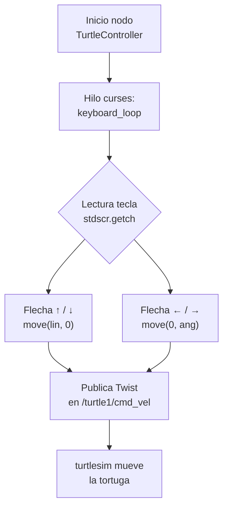
### 1.3 Código fuente 

El control manual de la tortuga se implementó mediante el nodo TurtleController, desarrollado sobre la clase Node de la librería rclpy. El nodo crea un publicador asociado al tópico /turtle1/cmd_vel, a través del cual se envían los comandos de velocidad lineal y angular utilizando mensajes de tipo geometry_msgs/Twist.

Para capturar la interacción del usuario se empleó la librería curses, que permite leer el teclado en modo no bloqueante. Cada pulsación de una tecla de dirección invoca el método move(), encargado de construir un mensaje Twist, asignar las velocidades correspondientes y publicarlo en el tópico de control. De esta forma, las flechas ↑ y ↓ producen el avance y retroceso de la tortuga, mientras que las flechas ← y → generan los giros sobre su eje.

Desde el punto de vista de ROS 2, el nodo hereda de rclpy.node.Node y utiliza self.create_publisher(Twist, '/turtle1/cmd_vel', 10) para declarar el publicador del tópico de velocidad. Para cada tecla presionada se construye un nuevo mensaje Twist, el cual se envía de manera asíncrona mediante publish(). Internamente, ROS 2 utiliza el middleware DDS para transportar estos mensajes hasta el nodo turtlesim, donde son interpretados para actualizar el movimiento de la tortuga en tiempo real.

```python 

class TurtleController(Node):

    def __init__(self):
        super().__init__('turtle_controller')

        self.pub = self.create_publisher(
            Twist,
            '/turtle1/cmd_vel',
            10
        )

        self.lin = 2.0
        self.ang = 3.5

    def move(self, l, a):
        msg = Twist()
        msg.linear.x = l
        msg.angular.z = a
        self.pub.publish(msg)

    def stop(self):
        self.move(0.0, 0.0)


def keyboard_loop(stdscr, node):
    curses.curs_set(0)
    stdscr.nodelay(True)

    while rclpy.ok():
        key = stdscr.getch()

        if key == curses.KEY_UP:
            node.move(node.lin, 0.0)

        elif key == curses.KEY_DOWN:
            node.move(-node.lin, 0.0)

        elif key == curses.KEY_LEFT:
            node.move(0.0, node.ang)

        elif key == curses.KEY_RIGHT:
            node.move(0.0, -node.ang)

        elif key == ord('q'):
            node.stop()

        time.sleep(0.02)
```

### 1.4 Evidencia

A continuación se presentan evidencias del funcionamiento del control manual implementado. La primera imagen corresponde a la interfaz de control mediante teclado y la segunda muestra el desplazamiento libre de la tortuga en el entorno de simulación.

<p align="center">
  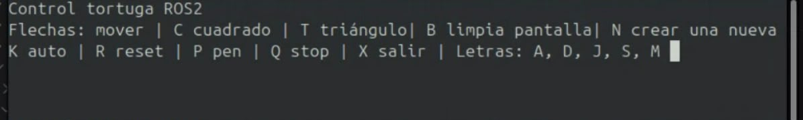
</p>

<p align="center">
<b>Figura 1.</b> Interfaz de control manual mediante teclado.
</p>

<p align="center">
  
</p>

<p align="center">
<b>Figura 2.</b> Movimiento libre de la tortuga utilizando las teclas de dirección.
</p>


## 2. Acciones complementarias y trayectorias automáticas

### 2.1 Explicación 

Las acciones complementarias fueron implementadas como métodos independientes dentro de la clase TurtleController, siguiendo un diseño modular que facilita la organización del código y el mantenimiento de cada funcionalidad. A través del teclado es posible ejecutar diferentes acciones: la tecla C permite dibujar un cuadrado (square()), T genera un triángulo equilátero (triangle()), R reinicia la posición de la tortuga mediante el servicio /turtle1/teleport_absolute (reset()), P activa o desactiva el lápiz utilizando el servicio /turtle1/set_pen (toggle_pen()), K inicia una trayectoria automática (auto()) y Q detiene completamente el movimiento de la tortuga (stop()).

Aunque el enunciado del laboratorio proponía utilizar la tecla A para la trayectoria automática, esta se reasignó a la tecla K, ya que la letra A fue destinada al dibujo de la inicial correspondiente a uno de los integrantes del equipo. Esta modificación permitió mantener todas las funcionalidades requeridas sin generar conflictos entre las asignaciones del teclado.

Con el fin de evitar que las trayectorias automáticas interrumpieran la ejecución del nodo, las funciones square(), triangle() y auto() se ejecutan en hilos independientes mediante la biblioteca threading. De esta forma, el programa continúa atendiendo nuevas entradas del teclado y procesando la comunicación con ROS 2 mientras se desarrolla cada trayectoria, cumpliendo con el requisito de no bloquear la ejecución del sistema.

Las figuras geométricas se generan alternando movimientos lineales y giros controlados. En el caso del cuadrado, cada lado se recorre mediante un desplazamiento rectilíneo seguido de un giro de 90°, mientras que para el triángulo equilátero se realizan giros de 120°. Los tiempos de giro se calcularon a partir del ángulo deseado y de la velocidad angular establecida, lo que permite obtener trayectorias con una geometría consistente.

Por su parte, la función auto() implementa un comportamiento reactivo basado en la posición actual de la tortuga, obtenida mediante la suscripción al tópico /turtle1/pose. Durante su ejecución, el algoritmo verifica continuamente si la tortuga se aproxima a los límites del entorno de simulación; en caso de detectar una proximidad al borde, detiene el movimiento, realiza un giro correctivo y posteriormente continúa su recorrido. Adicionalmente, la velocidad angular se modifica siguiendo una función sinusoidal, lo que produce trayectorias suaves y evita que la tortuga repita desplazamientos completamente rectilíneos.

### 2.2 Diagrama de flujo 

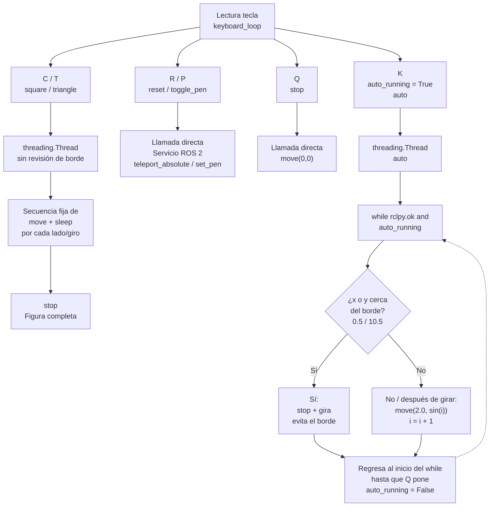

### 2.3 Código fuente 

Las acciones complementarias fueron implementadas como métodos independientes de la clase TurtleController, lo que permite mantener una estructura modular y facilita la incorporación de nuevas funcionalidades. Las trayectorias automáticas, como el dibujo de figuras geométricas y el movimiento autónomo, se ejecutan en hilos independientes mediante la biblioteca threading, evitando bloquear la lectura del teclado y la comunicación con ROS 2.

Las figuras geométricas se generan alternando movimientos lineales y giros controlados. En el caso del cuadrado, cada lado se recorre mediante un desplazamiento rectilíneo seguido de un giro de 90°, mientras que para el triángulo equilátero se realizan giros de 120°. Por otra parte, la función auto() implementa un comportamiento reactivo basado en la posición actual de la tortuga. Mientras la variable auto_running permanece activa, el algoritmo verifica continuamente la posición recibida desde el tópico /turtle1/pose. Si la tortuga se aproxima a alguno de los límites de la ventana de simulación, detiene temporalmente el movimiento, realiza un giro de aproximadamente 180° y reanuda su recorrido. En condiciones normales, la tortuga avanza con velocidad lineal constante, mientras que la velocidad angular varía de acuerdo con la función sin(i), generando una trayectoria oscilante que evita desplazamientos completamente rectilíneos.

Desde el punto de vista de ROS 2, las funciones reset() y toggle_pen() hacen uso del patrón cliente-servidor proporcionado por rclpy. Para ello, se crean clientes mediante self.create_client() asociados a los servicios TeleportAbsolute y SetPen, respectivamente. Antes de realizar una petición, el programa verifica que el servicio se encuentre disponible utilizando wait_for_service(). Posteriormente, la solicitud se envía de manera asíncrona mediante call_async(req), permitiendo que el nodo continúe ejecutando otras tareas mientras el servicio procesa la petición.

```python

def reset(self):
    while not self.reset_client.wait_for_service(timeout_sec=1.0):
        self.get_logger().info('Esperando servicio reset...')
    req = TeleportAbsolute.Request()
    req.x = 5.5
    req.y = 5.5
    req.theta = 0.0
    self.reset_client.call_async(req)


def toggle_pen(self):
    while not self.pen_client.wait_for_service(timeout_sec=1.0):
        self.get_logger().info('Esperando servicio set_pen...')
    self.pen_on = not self.pen_on
    req = SetPen.Request()
    req.r = 255
    req.g = 255
    req.b = 255
    req.width = 3
    req.off = 0 if self.pen_on else 1
    self.pen_client.call_async(req)


def square(self):
    for _ in range(4):
        self.move(2.0, 0.0)
        time.sleep(1.0)
        self.move(0.0, self.ang)
        time.sleep((math.pi / 2) / self.ang)
    self.stop()


def triangle(self):
    for _ in range(3):
        self.move(2.0, 0.0)
        time.sleep(1.0)
        self.move(0.0, self.ang)
        time.sleep((2 * math.pi / 3) / self.ang)
    self.stop()


def auto(self):

    i = 0

    while rclpy.ok() and self.auto_running:

        if (self.x <= 0.5 or self.x >= 10.5 or
            self.y <= 0.5 or self.y >= 10.5):

            self.stop()
            self.move(0.0, self.ang)
            time.sleep(math.pi / self.ang)
            self.stop()

        self.move(2.0, math.sin(i))
        time.sleep(0.4)

        i += 1

    self.stop()
```

Como complemento, el manejo de las teclas que activan estas funcionalidades se realiza desde keyboard_loop():


```python
elif key == ord('c'):
    threading.Thread(target=node.square).start()

elif key == ord('t'):
    threading.Thread(target=node.triangle).start()

elif key == ord('r'):
    node.reset()

elif key == ord('p'):
    node.toggle_pen()

elif key == ord('k'):
    threading.Thread(target=node.auto).start()

elif key == ord('q'):
    node.auto_running = False
    node.stop()

```

### 2.4 Evidencia

Las siguientes imágenes muestran las trayectorias automáticas implementadas para el dibujo de figuras geométricas. Las funcionalidades de **reset** y **activación/desactivación del lápiz** pueden observarse en el video de demostración, donde se evidencia el funcionamiento completo de dichas acciones complementarias.

<p align="center">
  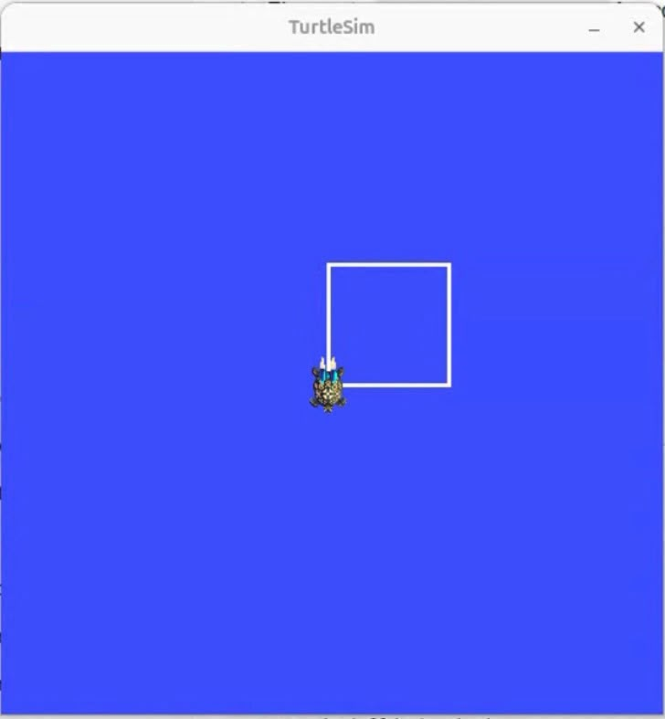
</p>

<p align="center">
<b>Figura 3.</b> Trayectoria automática para el dibujo de un cuadrado.
</p>

<p align="center">
  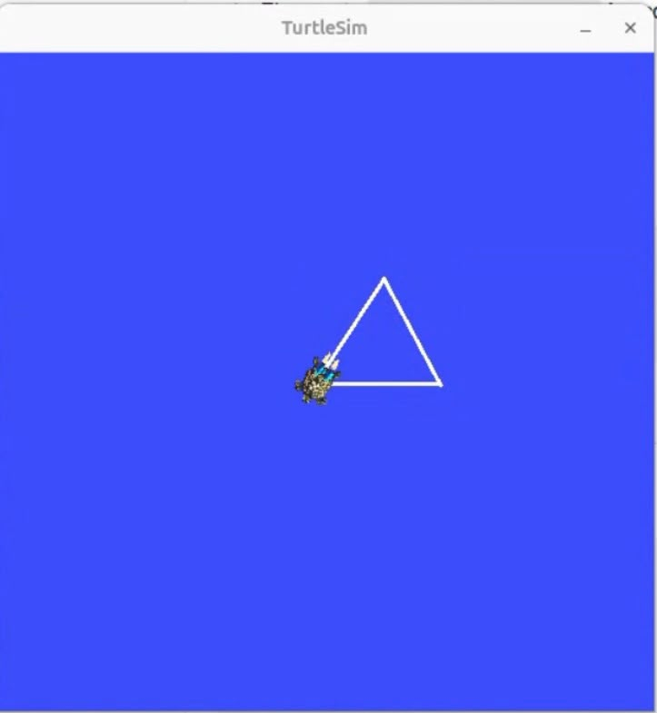
</p>

<p align="center">
<b>Figura 4.</b> Trayectoria automática para el dibujo de un triángulo equilátero.
</p>


## 3. Dibujo automático de letras personalizadas 

### 3.1 Explicación 

Para el dibujo automático de las iniciales de los integrantes del equipo se implementaron las letras A, J, M, S y D, correspondientes a los nombres Juan Diego Sáenz Ardila y Alejandra Sofía Monroy Socha. Cada letra fue desarrollada como un método independiente dentro de la clase TurtleController y asociada a una tecla específica del teclado (a, j, m, s y d), permitiendo su ejecución de forma individual y manteniendo una estructura modular del código.

Todas las funciones comparten una misma estrategia de implementación. Antes de iniciar el trazado de cada letra, la tortuga debe orientarse hacia una dirección específica. Para ello se desarrolló la función go_to_angle(), la cual implementa un controlador proporcional en lazo cerrado para el control de la orientación. A diferencia de los movimientos ejecutados únicamente mediante velocidades y tiempos predefinidos (control en lazo abierto), este controlador utiliza la realimentación proporcionada por la suscripción al tópico /turtle1/pose, que actualiza continuamente la orientación de la tortuga (self.theta). En cada iteración se calcula el error entre el ángulo deseado y el ángulo actual, el cual se normaliza al intervalo [−π,π] mediante la función atan2(sin(error), cos(error)), garantizando que la corrección se realice siguiendo la trayectoria angular más corta. Posteriormente, se aplica una velocidad angular proporcional al error (\omega = K_p \cdot error), repitiendo este proceso de medición, comparación y corrección hasta que el error es inferior a 0.01 rad. Gracias a esta estrategia de control en lazo cerrado, la tortuga alcanza con precisión la orientación requerida antes de comenzar el trazado de cada letra.

Una vez alcanzada la orientación inicial, cada letra se construye mediante una secuencia de desplazamientos lineales y giros controlados, utilizando la función move() junto con pausas temporizadas (time.sleep()), cuyos tiempos se calculan a partir de la distancia o del ángulo que se desea recorrer y de las velocidades lineal y angular definidas para el sistema. Este procedimiento permite obtener trazos con dimensiones y orientaciones consistentes. En el caso de la letra D, por ejemplo, la parte curva se genera mediante un movimiento circular en el que se mantiene una velocidad angular constante, mientras que la velocidad lineal se calcula a partir de la relación entre la longitud del arco y el tiempo de ejecución, permitiendo aproximar un semicírculo con el radio deseado. De manera similar, las demás letras se obtienen combinando segmentos rectos y giros cuidadosamente sincronizados para reproducir la geometría de cada inicial.

### 3.2 Diagrama de flujo 

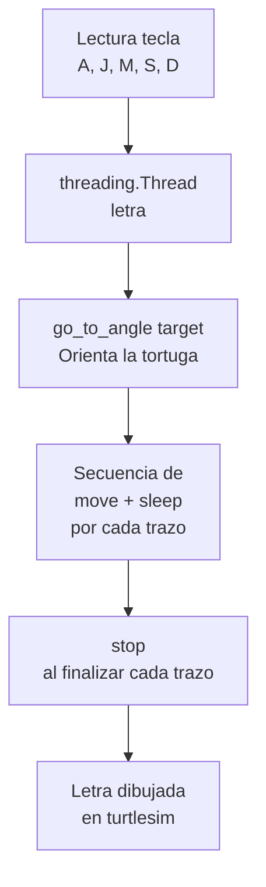

### 3.3 Código fuente 

El dibujo automático de las iniciales del equipo se implementó mediante métodos independientes para cada letra (A, J, M, S y D), manteniendo una estructura modular que facilita la organización del código y la incorporación de nuevas trayectorias. Todas las funciones siguen una misma estrategia: antes de iniciar el trazado, la tortuga se orienta hacia una dirección inicial específica y, posteriormente, ejecuta una secuencia de desplazamientos lineales y giros que reproducen la geometría de la letra correspondiente.

La orientación inicial se realiza mediante la función go_to_angle(), la cual implementa un controlador proporcional en lazo cerrado para el control de la orientación. En cada iteración se calcula el error entre el ángulo deseado y la orientación actual de la tortuga, normalizando dicho error al intervalo [−π,π] para garantizar que la corrección se efectúe siguiendo la trayectoria angular más corta. A partir de este error se genera una velocidad angular proporcional, repitiendo el proceso hasta alcanzar una orientación con un error inferior a 0.01 rad. Una vez alineada la tortuga, el resto del trazado se realiza mediante secuencias de movimientos lineales y giros temporizados utilizando la función move().

Desde el punto de vista de ROS 2, la función go_to_angle() depende directamente del mecanismo de retroalimentación proporcionado por rclpy. La variable self.theta, utilizada para calcular el error de orientación, se actualiza continuamente mediante la suscripción creada con self.create_subscription(Pose, '/turtle1/pose', self.pose_callback1, 10). Gracias a esta información recibida en tiempo real, el controlador proporcional puede comparar continuamente la orientación actual con la referencia deseada y corregir el movimiento hasta converger al ángulo objetivo antes de iniciar el dibujo de cada letra.

```python

def go_to_angle(self, target):
    kp = 3.0

    while rclpy.ok():
        error = target - self.theta
        error = math.atan2(math.sin(error), math.cos(error))

        if abs(error) < 0.01:
            break

        self.move(0.0, kp * error)
        time.sleep(0.02)

    self.stop()


def A(self):
    self.go_to_angle(math.pi / 2)

    self.move(2.0, 0.0)
    time.sleep(1.2)

    self.move(0.0, -self.ang)
    time.sleep((math.pi / 4) / self.ang)

    self.move(2.0, 0.0)
    time.sleep(0.8)

    self.stop()


def D(self):
    self.go_to_angle(math.pi / 2)

    self.move(2.0, 0.0)
    time.sleep(1.2)

    self.move(1.0, self.ang)
    time.sleep(math.pi / self.ang)

    self.stop()

```

El dibujo de cada letra se activa desde keyboard_loop() mediante la creación de un hilo independiente, evitando bloquear el procesamiento de nuevas entradas del teclado y la comunicación con ROS 2.

```python

elif key == ord('a'):
    threading.Thread(target=node.A).start()

elif key == ord('j'):
    threading.Thread(target=node.J).start()

elif key == ord('m'):
    threading.Thread(target=node.M).start()

elif key == ord('s'):
    threading.Thread(target=node.S).start()

elif key == ord('d'):
    threading.Thread(target=node.D).start()

```

### 3.4 Evidencia

A continuación se presentan las trayectorias obtenidas para cada una de las letras implementadas como parte del dibujo automático de las iniciales del equipo.

<p align="center">
  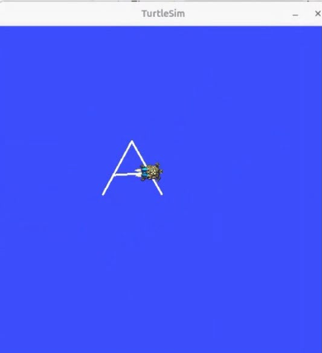
</p>

<p align="center">
<b>Figura 5.</b> Letra A.
</p>

<p align="center">
  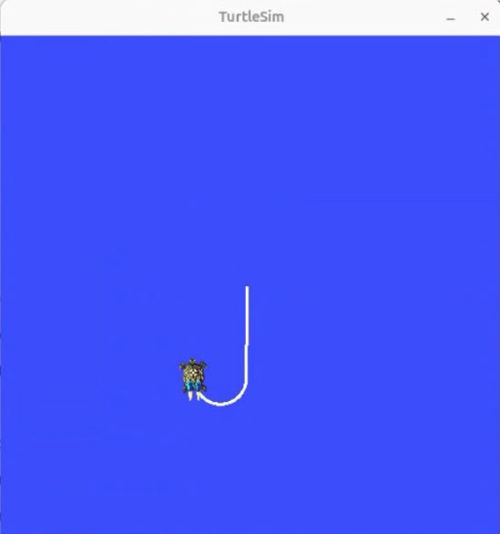
</p>

<p align="center">
<b>Figura 6.</b> Letra J.
</p>

<p align="center">
  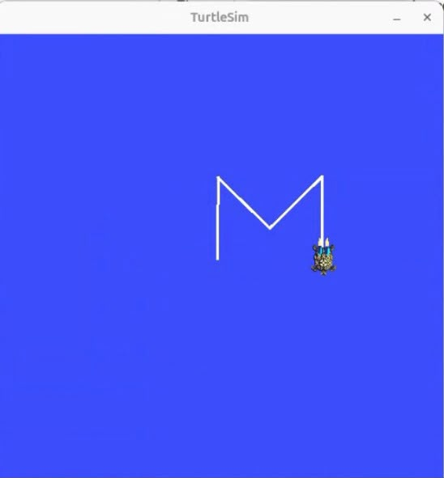
</p>

<p align="center">
<b>Figura 7.</b> Letra M.
</p>

<p align="center">
  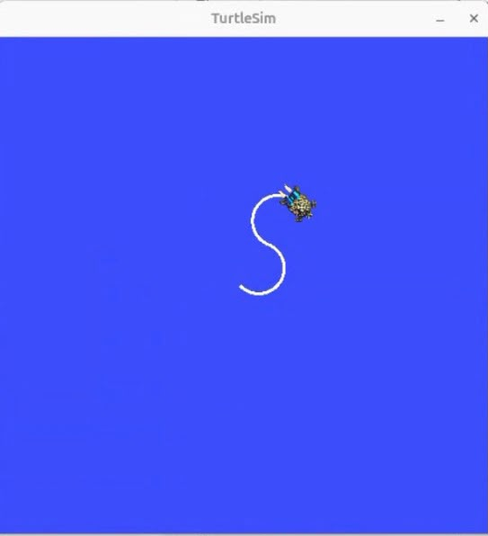
</p>

<p align="center">
<b>Figura 8.</b> Letra S.
</p>

<p align="center">
  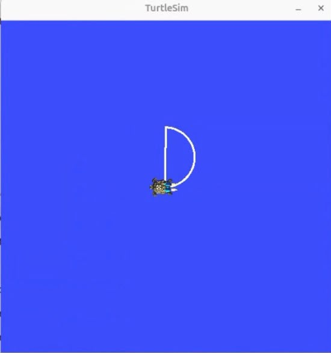
</p>

<p align="center">
<b>Figura 9.</b> Letra D.
</p>


## 4. Sistema líder-seguidor con dos tortugas 

### 4.1 Explicación 

El sistema líder-seguidor se activa mediante la tecla N. Al presionarla, se ejecuta la función spawn_turtle2(), la cual utiliza el servicio /spawn de turtlesim para crear una segunda tortuga denominada turtle2 en la posición inicial (1.0, 1.0). Posteriormente, se inicia un hilo de ejecución independiente (follower_loop()), encargado de ejecutar periódicamente la función follow_turtle1() mientras el nodo permanece activo. De esta manera, el seguimiento se realiza de forma continua sin interferir con el control manual de la tortuga líder ni con el funcionamiento general del nodo.

Para implementar el seguimiento, el sistema emplea dos suscripciones independientes a los tópicos /turtle1/pose y /turtle2/pose, las cuales actualizan continuamente la posición y orientación de la tortuga líder y de la seguidora, respectivamente. En cada iteración del algoritmo se calcula la diferencia de posiciones en los ejes x e y, la distancia euclidiana entre ambas tortugas y el ángulo que debe adoptar la tortuga seguidora para dirigirse hacia la líder. A partir de este último se determina el error de orientación con respecto al ángulo actual de turtle2, el cual se normaliza al intervalo [−π,π] para garantizar que la corrección se realice mediante el giro más corto.

Con la información obtenida se implementa un controlador proporcional en lazo cerrado para el seguimiento. La velocidad lineal de la tortuga seguidora se calcula como una constante proporcional a la distancia que la separa de la líder, mientras que la velocidad angular es proporcional al error de orientación. De esta forma, cuando la separación entre ambas aumenta, la tortuga incrementa su velocidad de avance, y cuando la diferencia de orientación es mayor, realiza giros más rápidos para alinearse con el objetivo. Las velocidades calculadas se encapsulan en un mensaje Twist y se publican en el tópico /turtle2/cmd_vel, permitiendo que turtle2 corrija continuamente su trayectoria y se aproxime de manera progresiva y estable a turtle1.

A diferencia de un seguimiento basado únicamente en trayectorias predefinidas, este enfoque utiliza la retroalimentación de la posición y orientación de ambas tortugas para actualizar constantemente las acciones de control. Como resultado, el sistema es capaz de adaptarse en tiempo real a los cambios de dirección y velocidad de la tortuga líder, manteniendo un comportamiento de seguimiento suave y continuo durante toda la ejecución.

### 4.2 Diagrama de flujo 

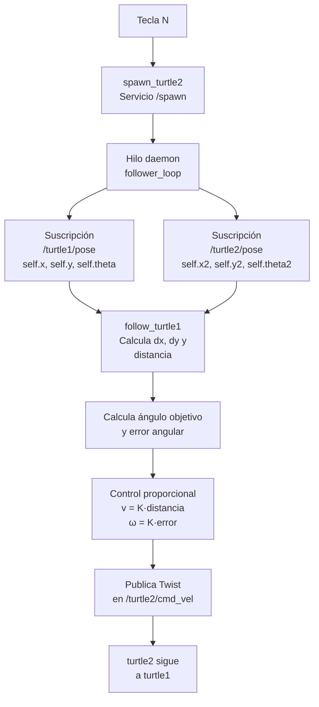

### 4.3 Código fuente 

El sistema líder-seguidor se implementó utilizando dos tortugas dentro del entorno turtlesim. La segunda tortuga se crea dinámicamente mediante el servicio /spawn y, una vez disponible, ejecuta de forma continua un algoritmo de seguimiento encargado de aproximarla a la posición de la tortuga líder. Para evitar interferir con el control manual de la primera tortuga, el algoritmo de seguimiento se ejecuta en un hilo independiente, lo que permite mantener simultáneamente la interacción del usuario y el procesamiento del controlador.

El seguimiento se realiza mediante un controlador proporcional en lazo cerrado basado en la posición relativa entre ambas tortugas. En cada iteración se calcula la distancia euclidiana y el ángulo que une la posición de la tortuga seguidora con la del líder. Posteriormente, se determina el error de orientación y se generan velocidades lineales y angulares proporcionales a la distancia y al error angular, respectivamente. Estas velocidades se encapsulan en un mensaje Twist y se publican continuamente sobre el tópico de control de la segunda tortuga, permitiendo que esta corrija de forma progresiva su trayectoria hasta mantenerse siguiendo al líder.

Desde el punto de vista de ROS 2, esta implementación demuestra la capacidad de un mismo nodo de rclpy para gestionar múltiples interfaces de comunicación de manera simultánea. Además del publicador y la suscripción utilizados para controlar turtle1, se crea un segundo publicador (self.pub2) asociado al tópico /turtle2/cmd_vel y una segunda suscripción (self.pose2_sub) al tópico /turtle2/pose. De esta manera, un único proceso de ROS 2 es capaz de controlar y monitorear ambas tortugas de forma concurrente, aprovechando el modelo de comunicación distribuida proporcionado por rclpy.

```python

class TurtleController(Node):

    def __init__(self):
        super().__init__('turtle_controller')

        self.pub2 = self.create_publisher(
            Twist,
            '/turtle2/cmd_vel',
            10
        )

        self.pose2_sub = self.create_subscription(
            Pose,
            '/turtle2/pose',
            self.pose_callback2,
            10
        )

    def pose_callback2(self, msg):
        self.x2 = msg.x
        self.y2 = msg.y
        self.theta2 = msg.theta

    def spawn_turtle2(self):
        while not self.spawn_client.wait_for_service(timeout_sec=1.0):
            self.get_logger().info('Esperando servicio spawn...')

        req = Spawn.Request()
        req.x = 1.0
        req.y = 1.0
        req.theta = 0.0
        req.name = 'turtle2'

        self.spawn_client.call_async(req)

    def follower_loop(self):
        while rclpy.ok():
            self.follow_turtle1()
            time.sleep(0.05)

    def follow_turtle1(self):
        dx = self.x - self.x2
        dy = self.y - self.y2

        distance = math.sqrt(dx**2 + dy**2)

        target_angle = math.atan2(dy, dx)
        error_angle = target_angle - self.theta2
        error_angle = math.atan2(
            math.sin(error_angle),
            math.cos(error_angle)
        )

        msg = Twist()
        msg.linear.x = 2.0 * distance
        msg.angular.z = 4.0 * error_angle

        self.pub2.publish(msg)

```

La activación del sistema líder-seguidor se realiza desde keyboard_loop(), donde la tecla N crea la segunda tortuga y lanza el hilo encargado de ejecutar continuamente el algoritmo de seguimiento.

```python

elif key == ord('n'):
    node.spawn_turtle2()
    threading.Thread(
        target=node.follower_loop,
        daemon=True
    ).start()

```

### 4.4 Evidencia 

La siguiente imagen evidencia el funcionamiento del sistema líder-seguidor, en el cual una segunda tortuga sigue continuamente la trayectoria de la tortuga controlada por el usuario mediante un controlador proporcional.

<p align="center">
  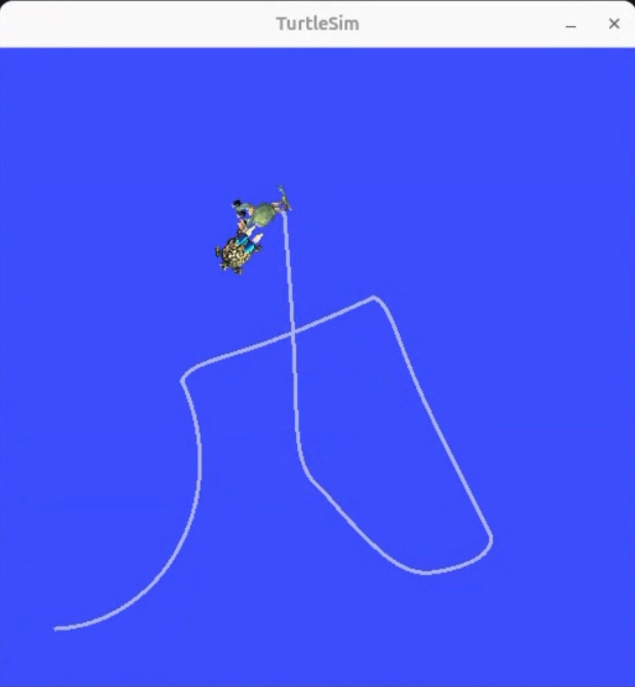
</p>

<p align="center">
<b>Figura 10.</b> Funcionamiento del sistema líder-seguidor.
</p>

## 5. Verificación de la arquitectura de ROS 2

Con el fin de verificar el funcionamiento de la arquitectura de comunicación implementada durante el laboratorio, se emplearon diversas herramientas de línea de comandos de ROS 2. Estas permiten inspeccionar los nodos, tópicos, servicios y conexiones existentes entre el nodo desarrollado (`turtle_controller`) y el simulador `turtlesim`, validando el modelo de comunicación basado en publicadores, suscriptores y servicios.

La siguiente tabla resume los comandos utilizados y la información que aporta cada uno para el análisis de la arquitectura del sistema.

| Comando | Información verificada |
|:---------|:-----------------------|
| `ros2 node list` | Muestra los nodos activos del sistema, entre ellos `/turtle_controller` (nodo desarrollado) y `/turtlesim` (simulador), evidenciando que el control y la simulación se ejecutan como procesos independientes que se comunican mediante el middleware DDS de ROS 2. |
| `ros2 topic list` | Lista los tópicos disponibles, incluyendo `/turtle1/cmd_vel`, `/turtle2/cmd_vel`, `/turtle1/pose` y `/turtle2/pose`, confirmando la existencia de los canales de comunicación utilizados por el nodo para el envío y recepción de información. |
| `ros2 topic echo /turtle1/pose` | Visualiza en tiempo real los mensajes de tipo `Pose` publicados por `turtlesim`, mostrando variables como `x`, `y`, `theta`, `linear_velocity` y `angular_velocity`, las cuales son utilizadas por el nodo para actualizar continuamente el estado de la tortuga. |
| `ros2 topic info /turtle1/cmd_vel` | Permite verificar el tipo de mensaje asociado al tópico (`geometry_msgs/msg/Twist`), así como el número de publicadores y suscriptores conectados, confirmando la correcta comunicación entre `turtle_controller` y `turtlesim`. |
| `ros2 service list` | Muestra los servicios disponibles en el sistema, entre ellos `/turtle1/teleport_absolute`, `/turtle1/set_pen`, `/clear` y `/spawn`, utilizados por las funciones `reset()`, `toggle_pen()`, `clear_screen()` y `spawn_turtle2()`, respectivamente. |
| `rqt_graph` | Genera una representación gráfica de la arquitectura de ROS 2, permitiendo visualizar las conexiones entre `turtle_controller` y `turtlesim` mediante los tópicos `/turtle1/cmd_vel`, `/turtle2/cmd_vel`, `/turtle1/pose` y `/turtle2/pose`. |

### 5.1 `ros2 node list`

<p align="center">
  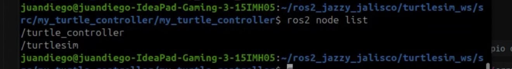
</p>

<p align="center">
<b>Figura 11.</b> Resultado del comando <code>ros2 node list</code>.
</p>

Se observa la presencia de los nodos `/turtle_controller` y `/turtlesim`, verificando que ambos se ejecutan como procesos independientes dentro del grafo de ROS 2.

### 5.2 `ros2 topic list`

<p align="center">
  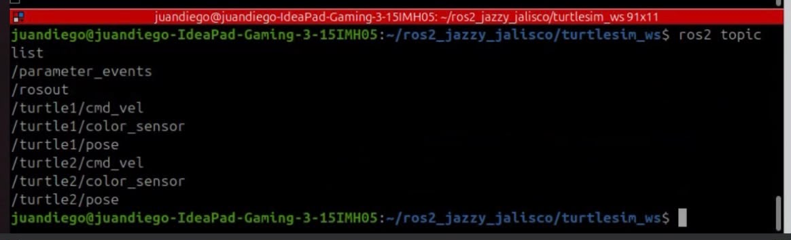
</p>

<p align="center">
<b>Figura 12.</b> Resultado del comando <code>ros2 topic list</code>.
</p>

Se identifican los tópicos utilizados para el intercambio de información entre ambos nodos, incluyendo los correspondientes al control y a la retroalimentación de las dos tortugas.

### 5.3 `ros2 topic echo /turtle1/pose`

<p align="center">
  
</p>

<p align="center">
<b>Figura 13.</b> Resultado del comando <code>ros2 topic echo /turtle1/pose</code>.
</p>


La salida muestra la publicación continua de mensajes de tipo `Pose`, evidenciando la retroalimentación utilizada por el controlador para actualizar continuamente la posición y orientación de la tortuga.

### 5.4 `ros2 topic info /turtle1/cmd_vel`

<p align="center">
  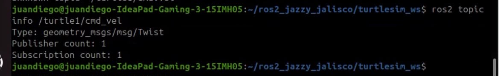
</p>

<p align="center">
<b>Figura 14.</b> Resultado del comando <code>ros2 topic info /turtle1/cmd_vel</code>.
</p>

Se verifica que el tópico utiliza mensajes `geometry_msgs/msg/Twist` y que existe un publicador (`turtle_controller`) y un suscriptor (`turtlesim`), validando el esquema publicador–suscriptor implementado.

### 5.5 `ros2 service list`

<p align="center">
  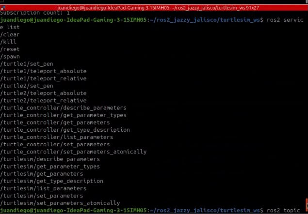
</p>

<p align="center">
<b>Figura 15.</b> Resultado del comando <code>ros2 service list</code>.
</p>

Se comprueba la disponibilidad de los servicios utilizados durante el desarrollo del laboratorio, como `/turtle1/teleport_absolute`, `/turtle1/set_pen`, `/clear` y `/spawn`, empleados para reiniciar la posición de la tortuga, controlar el lápiz, limpiar la pantalla y crear una segunda tortuga.

### 5.6 `rqt_graph`

<p align="center">
  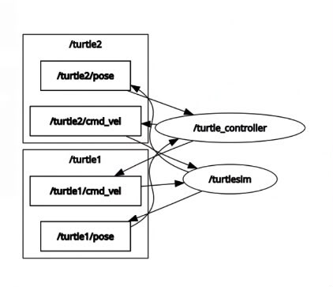
</p>

<p align="center">
<b>Figura 16.</b> Grafo de comunicación generado por <code>rqt_graph</code>, mostrando la relación entre los nodos <code>/turtle_controller</code> y <code>/turtlesim</code>, así como los tópicos asociados a <code>turtle1</code> y <code>turtle2</code>.
</p>

<p align="center">
  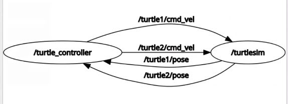
</p>

<p align="center">
<b>Figura 17.</b> Vista simplificada del grafo de comunicación, donde se observan los tópicos utilizados para el intercambio de mensajes entre <code>/turtle_controller</code> y <code>/turtlesim</code>.
</p>

Estas figuras permiten verificar la arquitectura de comunicación implementada durante el laboratorio. En ellas se observa que el nodo `turtle_controller` publica mensajes de velocidad en los tópicos `/turtle1/cmd_vel` y `/turtle2/cmd_vel`, mientras que el nodo `turtlesim` se suscribe a dichos tópicos para controlar el movimiento de ambas tortugas. De manera complementaria, `turtlesim` publica continuamente la información de estado en los tópicos `/turtle1/pose` y `/turtle2/pose`, los cuales son utilizados por `turtle_controller` como retroalimentación para implementar el control de orientación durante el trazado de letras y el algoritmo líder-seguidor. Esta representación confirma el uso del modelo publicador–suscriptor de ROS 2 y evidencia cómo un mismo nodo puede gestionar múltiples publicadores y suscriptores de forma simultánea.

## 6. Código completo laboratorio 4

El código fuente completo correspondiente a la implementación desarrollada en este laboratorio se encuentra disponible en el archivo [move_turtle.MD](move_turtle.MD).

## 7. Video explicativo 


## Gracias 
