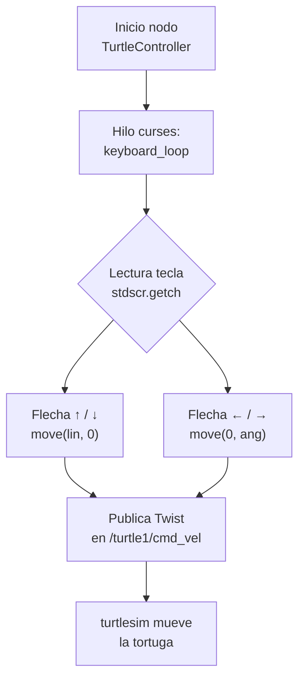
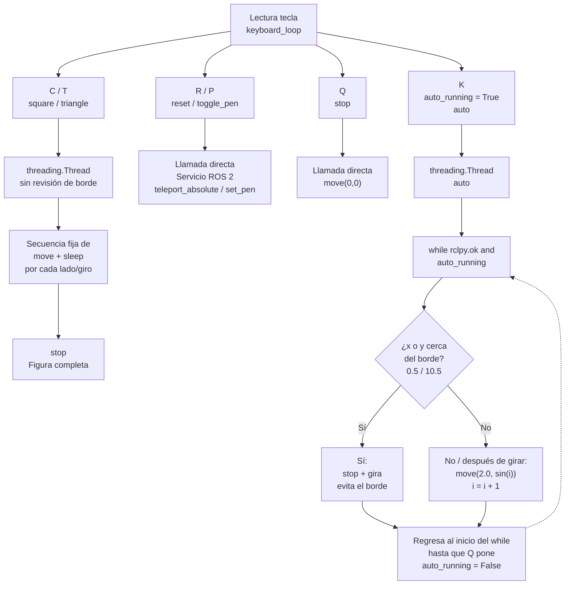
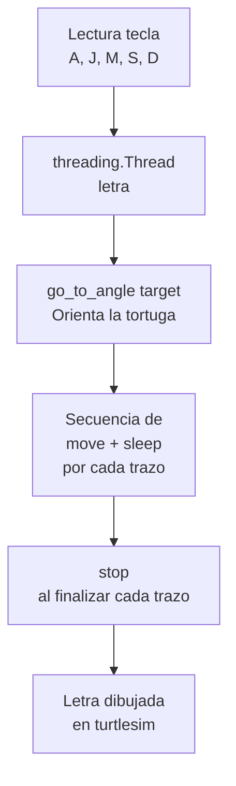
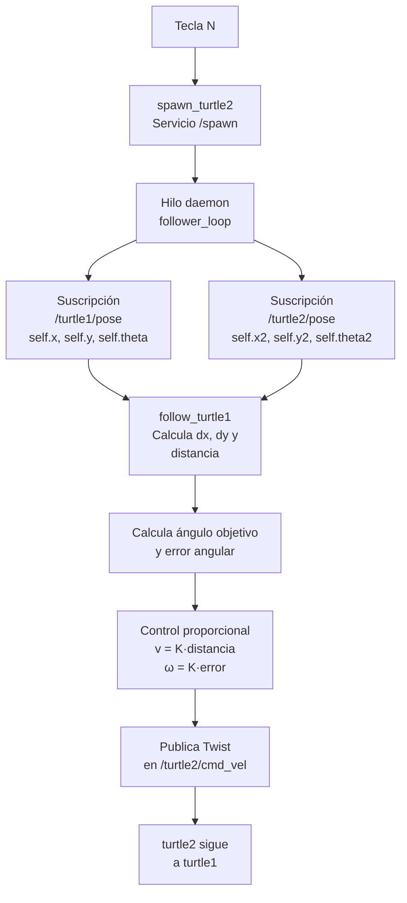

<h3>Curso de Robótica 2026-I</h3>

<h1>Desarrollo Laboratorio No.4 </h1>
<h2> Robótica de Desarrollo, Intro a ROS2 Jazzy Jalisco - Turtlesim </h2>

<h3>Profesores: Pedro Fabián Cárdenas Herrera   Manuel Felipe Carranza Montenegro</h3>

<h3>Estudiantes: Juan Diego Sáenz Ardila   Alejandra Sofia Monroy Socha   </h3>

## 1. Control de movimiento manual 

### 1.1 Explicación 

El control manual de la tortuga se implementó mediante el nodo TurtleController, desarrollado sobre la clase Node de la librería rclpy. Este nodo crea un publicador (self.pub) asociado al tópico /turtle1/cmd_vel, utilizando mensajes de tipo geometry_msgs/Twist, a través del cual se envían las órdenes de movimiento de la tortuga.

La interacción con el usuario se realiza mediante la librería curses, que permite capturar las teclas del teclado en modo no bloqueante (stdscr.nodelay(True)). Cada vez que se detecta una pulsación, se invoca el método move(l, a), encargado de construir un mensaje Twist, asignando la velocidad lineal al campo linear.x y la velocidad angular al campo angular.z, para posteriormente publicarlo en el tópico correspondiente.

Las flechas del teclado se asignaron a las acciones básicas de desplazamiento: la flecha ↑ ordena el avance de la tortuga (move(lin, 0.0)), la flecha ↓ el retroceso (move(-lin, 0.0)), la flecha ← el giro hacia la izquierda (move(0.0, ang)) y la flecha → el giro hacia la derecha (move(0.0, -ang)), donde lin = 2.0 corresponde a la velocidad lineal y ang = 3.5 rad/s a la velocidad angular.

La lectura del teclado se ejecuta de manera continua dentro de un ciclo while en la función keyboard_loop, mientras que el procesamiento de la comunicación con ROS 2 se mantiene en un hilo independiente mediante rclpy.spin(). Esta organización permite que el nodo permanezca respondiendo a los mensajes de ROS 2 al mismo tiempo que procesa las entradas del usuario, evitando bloqueos durante la ejecución del programa.

### 1.2 Diagrama de flujo 

### 1.3 Código fuente 

### 1.4 Evidencia (video)

## 2. Acciones complementarias y trayectorias automáticas

### 2.1 Explicación 

Las acciones complementarias fueron implementadas como métodos independientes dentro de la clase TurtleController, siguiendo un diseño modular que facilita la organización del código y el mantenimiento de cada funcionalidad. A través del teclado es posible ejecutar diferentes acciones: la tecla C permite dibujar un cuadrado (square()), T genera un triángulo equilátero (triangle()), R reinicia la posición de la tortuga mediante el servicio /turtle1/teleport_absolute (reset()), P activa o desactiva el lápiz utilizando el servicio /turtle1/set_pen (toggle_pen()), K inicia una trayectoria automática (auto()) y Q detiene completamente el movimiento de la tortuga (stop()).

Aunque el enunciado del laboratorio proponía utilizar la tecla A para la trayectoria automática, esta se reasignó a la tecla K, ya que la letra A fue destinada al dibujo de la inicial correspondiente a uno de los integrantes del equipo. Esta modificación permitió mantener todas las funcionalidades requeridas sin generar conflictos entre las asignaciones del teclado.

Con el fin de evitar que las trayectorias automáticas interrumpieran la ejecución del nodo, las funciones square(), triangle() y auto() se ejecutan en hilos independientes mediante la biblioteca threading. De esta forma, el programa continúa atendiendo nuevas entradas del teclado y procesando la comunicación con ROS 2 mientras se desarrolla cada trayectoria, cumpliendo con el requisito de no bloquear la ejecución del sistema.

Las figuras geométricas se generan alternando movimientos lineales y giros controlados. En el caso del cuadrado, cada lado se recorre mediante un desplazamiento rectilíneo seguido de un giro de 90°, mientras que para el triángulo equilátero se realizan giros de 120°. Los tiempos de giro se calcularon a partir del ángulo deseado y de la velocidad angular establecida, lo que permite obtener trayectorias con una geometría consistente.

Por su parte, la función auto() implementa un comportamiento reactivo basado en la posición actual de la tortuga, obtenida mediante la suscripción al tópico /turtle1/pose. Durante su ejecución, el algoritmo verifica continuamente si la tortuga se aproxima a los límites del entorno de simulación; en caso de detectar una proximidad al borde, detiene el movimiento, realiza un giro correctivo y posteriormente continúa su recorrido. Adicionalmente, la velocidad angular se modifica siguiendo una función sinusoidal, lo que produce trayectorias suaves y evita que la tortuga repita desplazamientos completamente rectilíneos.

### 2.2 Diagrama de flujo 

### 2.3 Código fuente 

### 2.4 Evidencia (video)

## 3. Dibujo automático de letras personalizadas 

### 3.1 Explicación 

Para el dibujo automático de las iniciales de los integrantes del equipo se implementaron las letras A, J, M, S y D, correspondientes a los nombres Juan Diego Sáenz Ardila y Alejandra Sofía Monroy Socha. Cada letra fue desarrollada como un método independiente dentro de la clase TurtleController y asociada a una tecla específica del teclado (a, j, m, s y d), permitiendo su ejecución de forma individual y manteniendo una estructura modular del código.

Todas las funciones comparten una misma estrategia de implementación. Antes de iniciar el trazado de cada letra, la tortuga debe orientarse hacia una dirección específica. Para ello se desarrolló la función go_to_angle(), la cual implementa un controlador proporcional en lazo cerrado para el control de la orientación. A diferencia de los movimientos ejecutados únicamente mediante velocidades y tiempos predefinidos (control en lazo abierto), este controlador utiliza la realimentación proporcionada por la suscripción al tópico /turtle1/pose, que actualiza continuamente la orientación de la tortuga (self.theta). En cada iteración se calcula el error entre el ángulo deseado y el ángulo actual, el cual se normaliza al intervalo [−π,π] mediante la función atan2(sin(error), cos(error)), garantizando que la corrección se realice siguiendo la trayectoria angular más corta. Posteriormente, se aplica una velocidad angular proporcional al error (\omega = K_p \cdot error), repitiendo este proceso de medición, comparación y corrección hasta que el error es inferior a 0.01 rad. Gracias a esta estrategia de control en lazo cerrado, la tortuga alcanza con precisión la orientación requerida antes de comenzar el trazado de cada letra.

Una vez alcanzada la orientación inicial, cada letra se construye mediante una secuencia de desplazamientos lineales y giros controlados, utilizando la función move() junto con pausas temporizadas (time.sleep()), cuyos tiempos se calculan a partir de la distancia o del ángulo que se desea recorrer y de las velocidades lineal y angular definidas para el sistema. Este procedimiento permite obtener trazos con dimensiones y orientaciones consistentes. En el caso de la letra D, por ejemplo, la parte curva se genera mediante un movimiento circular en el que se mantiene una velocidad angular constante, mientras que la velocidad lineal se calcula a partir de la relación entre la longitud del arco y el tiempo de ejecución, permitiendo aproximar un semicírculo con el radio deseado. De manera similar, las demás letras se obtienen combinando segmentos rectos y giros cuidadosamente sincronizados para reproducir la geometría de cada inicial.

### 3.2 Diagrama de flujo 

### 3.3 Código fuente 

### 3.4 Evidencia (video)

## 4. Sistema líder-seguidor con dos tortugas 

### 4.1 Explicación 

El sistema líder-seguidor se activa mediante la tecla N. Al presionarla, se ejecuta la función spawn_turtle2(), la cual utiliza el servicio /spawn de turtlesim para crear una segunda tortuga denominada turtle2 en la posición inicial (1.0, 1.0). Posteriormente, se inicia un hilo de ejecución independiente (follower_loop()), encargado de ejecutar periódicamente la función follow_turtle1() mientras el nodo permanece activo. De esta manera, el seguimiento se realiza de forma continua sin interferir con el control manual de la tortuga líder ni con el funcionamiento general del nodo.

Para implementar el seguimiento, el sistema emplea dos suscripciones independientes a los tópicos /turtle1/pose y /turtle2/pose, las cuales actualizan continuamente la posición y orientación de la tortuga líder y de la seguidora, respectivamente. En cada iteración del algoritmo se calcula la diferencia de posiciones en los ejes x e y, la distancia euclidiana entre ambas tortugas y el ángulo que debe adoptar la tortuga seguidora para dirigirse hacia la líder. A partir de este último se determina el error de orientación con respecto al ángulo actual de turtle2, el cual se normaliza al intervalo [−π,π] para garantizar que la corrección se realice mediante el giro más corto.

Con la información obtenida se implementa un controlador proporcional en lazo cerrado para el seguimiento. La velocidad lineal de la tortuga seguidora se calcula como una constante proporcional a la distancia que la separa de la líder, mientras que la velocidad angular es proporcional al error de orientación. De esta forma, cuando la separación entre ambas aumenta, la tortuga incrementa su velocidad de avance, y cuando la diferencia de orientación es mayor, realiza giros más rápidos para alinearse con el objetivo. Las velocidades calculadas se encapsulan en un mensaje Twist y se publican en el tópico /turtle2/cmd_vel, permitiendo que turtle2 corrija continuamente su trayectoria y se aproxime de manera progresiva y estable a turtle1.

A diferencia de un seguimiento basado únicamente en trayectorias predefinidas, este enfoque utiliza la retroalimentación de la posición y orientación de ambas tortugas para actualizar constantemente las acciones de control. Como resultado, el sistema es capaz de adaptarse en tiempo real a los cambios de dirección y velocidad de la tortuga líder, manteniendo un comportamiento de seguimiento suave y continuo durante toda la ejecución.

### 4.2 Diagrama de flujo 

### 4.3 Código fuente 

### 4.4 Evidencia (video)

## 5. Verificación de la arquitectura de ROS 2

## Gracias 
