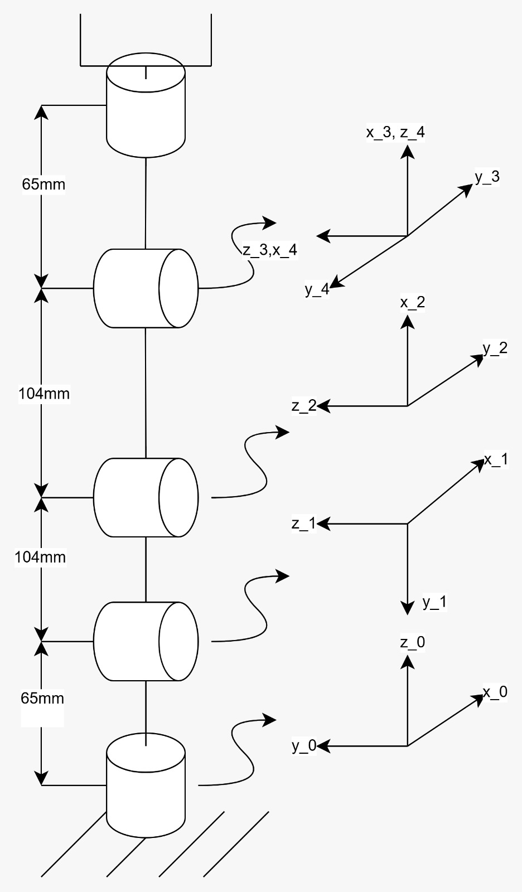

<div align="center">
<h3>Curso de Robótica 2026-I</h3>

<h1>Desarrollo Laboratorio No.5 </h1>
<h2> Phantom X Pincher X100 – ROS 2 Jazzy – RViz - Turtlesim </h2>

<h3>Profesores: Pedro Fabián Cárdenas Herrera <br> Manuel Felipe Carranza Montenegro</h3>

<h3>Estudiantes: Juan Diego Sáenz Ardila <br> Alejandra Sofia Monroy Socha <br> </h3>

</div>

# Actividad 1. Preparación del robot 

Para iniciar el entorno de simulación del PhantomX Pincher, primero navegue hasta el directorio del workspace del robot.

Abra dos terminales dentro del workspace. En ambas terminales ejecute los siguientes comandos para compilar el proyecto y cargar el entorno de trabajo:

```python
source install/setup.bash
```

```python
colcon build
```

Si el workspace se recompila, es recomendable volver a ejecutar `source install/setup.bash` una vez finalice el proceso de compilación.

En la primera terminal, inicie el entorno de simulación ejecutando:
```python
ros2 launch pincher_description display_gui.launch.py use_meshes:=true
```

Este comando abrirá RViz, cargará el modelo del PhantomX Pincher y mostrará un panel gráfico desde el cual es posible controlar manualmente las articulaciones del robot.

Si desea conectar el robot físico, asegúrese de que esté conectado al computador mediante USB y, en la segunda terminal, ejecute:

```python
ros2 launch pincher_control pincher_system.launch.py \
  motor_model:=xl430 \
  use_hardware:=true \
  use_meshes:=true
```

Con estos pasos, el robot quedará listo para ser visualizado en RViz y, si está conectado el hardware, podrá controlarse directamente desde la interfaz gráfica.

# Actividad 2. Identificación de motores y articulaciones

En esta actividad se identificaron las cinco articulaciones del robot Phantom X Pincher X100, junto con el identificador DYNAMIXEL asignado a cada servomotor, la referencia del actuador, el sentido positivo de movimiento y la función que desempeña cada una dentro del manipulador. Esta información constituye la base para la implementación de los algoritmos de control desarrollados en las actividades posteriores.

## Identificación de las articulaciones

| Articulación | ID | Referencia | Sentido positivo | Función |
|:------------:|:--:|:----------:|:----------------:|----------|
| Base | 1 | AX-12A | Antihorario | Rotación de la base del robot. |
| Hombro | 2 | AX-12A | Elevación | Permite elevar y descender el brazo principal. |
| Codo | 3 | AX-12A | Flexión | Modifica la apertura del brazo mediante la flexión del antebrazo. |
| Muñeca | 4 | AX-12A | Rotación | Orienta el efector final antes de la pinza. |
| Pinza | 5 | AX-12A | Apertura | Permite la apertura y el cierre de la pinza para sujetar objetos. |

---
# Actividad 3. Medición del robot

<p align="center">
  
</p>

# Actividad 4. Movimiento individual de articulaciones

Para esta actividad se implementó el nodo `individual_joint_move.py`, cuyo propósito es controlar de manera independiente cada una de las articulaciones del robot Phantom X Pincher X100. El programa publica comandos sobre el tópico `/pincher/command` utilizando mensajes del tipo `sensor_msgs/JointState`, enviando únicamente la articulación que se desea mover mientras las demás permanecen en su posición actual.

El funcionamiento del programa corresponde al modo demostración, en el cual cada articulación ejecuta automáticamente tres posiciones angulares predefinidas dentro de sus límites seguros y posteriormente retorna a la posición de referencia. De esta manera se verifica el movimiento individual de la base, hombro, codo, muñeca y pinza, tal como lo solicita la guía del laboratorio.

## Posiciones de demostración

Se definieron tres posiciones de prueba para cada articulación. Estas posiciones se encuentran dentro de los límites seguros del manipulador y permiten comprobar el correcto funcionamiento de cada eje.

```python
DEMO_POSITIONS_DEG = {
    "waist": [-40.0, 0.0, 40.0],
    "shoulder": [-30.0, 20.0, -10.0],
    "elbow": [30.0, -30.0, 10.0],
    "wrist": [-40.0, 40.0, 0.0],
    "gripper": [-60.0, 60.0, 0.0],
}
```

Cada conjunto de posiciones es recorrido automáticamente antes de regresar la articulación a la posición inicial.

## Creación del nodo ROS 2

Se implementó la clase `IndividualJointMover`, encargada de crear el nodo y el publicador que envía los comandos al robot mediante el tópico `/pincher/command`.

```python
class IndividualJointMover(Node):

    def __init__(self):

        super().__init__("individual_joint_move")

        self.publisher = self.create_publisher(
            JointState,
            "/pincher/command",
            10
        )

        time.sleep(0.3)
```

Una vez inicializado el nodo, este queda preparado para publicar los mensajes de control hacia el manipulador.

## Envío de movimientos

Cada movimiento es validado antes de ser enviado para garantizar que el ángulo solicitado se encuentre dentro del rango seguro de operación. Posteriormente se construye un mensaje `JointState` con el nombre de la articulación y la posición angular correspondiente.

```python
def send(self, joint: str, angle_deg: float) -> None:

    angle_deg = check_safe(joint, angle_deg)

    msg = JointState()

    msg.header.stamp = self.get_clock().now().to_msg()

    msg.name = [joint]

    msg.position = [math.radians(angle_deg)]

    self.publisher.publish(msg)
```

La función `check_safe()` impide el envío de posiciones que excedan los límites definidos para el robot.

## Ejecución automática de la demostración

El modo demostración recorre automáticamente todas las articulaciones del robot. Para cada una se ejecutan tres posiciones angulares y finalmente se retorna a la posición de referencia.

```python
def run_demo(node, settle_s=2.0):

    for joint in JOINT_ORDER:

        for angle in DEMO_POSITIONS_DEG[joint]:

            node.send(joint, angle)

            time.sleep(settle_s)

        node.go_home(joint)
```

Este procedimiento permite comprobar el funcionamiento independiente de cada articulación antes de continuar con las demás.

## Código fuente completo

El código completo desarrollado para esta actividad se encuentra en el archivo: 
[individual_joint_move.py](individual_joint_move.MD) 

---

# Actividad 6. Determinación de límites seguros

Para esta actividad se implementó el módulo `joint_limits.py`, encargado de definir y validar los límites seguros de operación para cada una de las articulaciones del robot Phantom X Pincher X100. Su objetivo es impedir el envío de posiciones que puedan llevar al manipulador a alcanzar los topes mecánicos, proporcionando una capa adicional de seguridad antes de ejecutar cualquier movimiento.

El módulo es utilizado por los programas de control desarrollados en las actividades posteriores, verificando automáticamente que cada posición solicitada se encuentre dentro del rango permitido antes de ser enviada al robot.

## Definición de los límites desde DYNAMIXEL

Inicialmente se establecieron los límites de operación definidos para cada articulación del robot. Para la base, hombro, codo y muñeca se considera un recorrido de ±150°, mientras que la pinza posee un rango de ±90°.

```python
FACTORY_LIMITS_DEG = {
    "waist": (-150.0, 150.0),
    "shoulder": (-150.0, 150.0),
    "elbow": (-150.0, 150.0),
    "wrist": (-150.0, 150.0),
    "gripper": (-90.0, 90.0),
}
```

Estos valores corresponden al rango máximo de operación permitido para cada articulación. Luego, con el fin de evitar que el robot alcance los topes mecánicos, se definió un margen de seguridad de 5° para todas las articulaciones.

```python
MARGIN_DEG = {
    "waist": 5.0,
    "shoulder": 5.0,
    "elbow": 5.0,
    "wrist": 5.0,
    "gripper": 5.0,
}
```

Este margen reduce el rango efectivo de movimiento y proporciona una operación más segura durante la ejecución de las trayectorias.

## Construcción de los límites seguros

A partir de los límites de fábrica y del margen definido, el programa calcula automáticamente el rango seguro de cada articulación.

```python
def build_safe_limits():

    safe = {}

    for joint, (lo, hi) in FACTORY_LIMITS_DEG.items():

        m = MARGIN_DEG[joint]

        safe[joint] = SafeLimit(
            lower_deg=lo + m,
            upper_deg=hi - m,
            margin_deg=m,
        )

    return safe
```

De esta forma se generan los límites utilizados por el resto de los programas del proyecto.

## Validación de movimientos

Antes de enviar cualquier comando al robot, el programa verifica que el ángulo solicitado pertenezca al rango seguro correspondiente.

```python
def check_safe(joint: str, angle_deg: float):

    limit = SAFE_LIMITS[joint]

    if not (limit.lower_deg <= angle_deg <= limit.upper_deg):

        raise OutOfSafeRangeError(...)

    return angle_deg
```

Si el valor solicitado supera alguno de los límites establecidos, el programa genera una excepción e impide el envío del movimiento, evitando posibles colisiones con los topes mecánicos.

## Límites seguros obtenidos

Los límites implementados para cada articulación se resumen en la siguiente tabla.

| Articulación | Límite inferior | Límite superior | Margen |
|:------------:|:---------------:|:---------------:|:-------:|
| Base | -145° | 145° | 5° |
| Hombro | -145° | 145° | 5° |
| Codo | -145° | 145° | 5° |
| Muñeca | -145° | 145° | 5° |
| Pinza | -85° | 85° | 5° |

## Código fuente completo

El código completo desarrollado para esta actividad se encuentra en el archivo:

[joint_limits.py](join_limits-MD)

---
# Actividad 7. Movimiento individual de articulaciones

Para realizar el desplazamiento simultáneo de todas las articulaciones se implementaron dos funciones principales: `desplazar_a_configuracion()` y `ejecutar_secuencia_pasos()`. Ambas trabajan de forma conjunta para enviar una secuencia de posiciones al robot utilizando el tópico de estados articulares de ROS 2.

La función `desplazar_a_configuracion(self, angulos_grados)` es la encargada de publicar una configuración articular completa. 
```python
  def desplazar_a_configuracion(self, angulos_grados):
        """Toma una lista de 5 ángulos en grados y los publica a RViz."""
        msg = JointState()
        msg.header.stamp = self.get_clock().now().to_msg()
        msg.name = self.joint_names
        msg.position = [math.radians(deg) for deg in angulos_grados]
        self.publisher_.publish(msg)
```
Como parámetro recibe una lista con cinco ángulos, correspondientes a las articulaciones del PhantomX Pincher, expresados en grados. En primer lugar, se crea un mensaje de tipo `JointState`, el cual es el formato estándar utilizado por ROS 2 para representar el estado de las articulaciones de un robot. Posteriormente, se actualiza el campo `header.stamp` con la hora actual mediante `self.get_clock().now().to_msg()`, permitiendo que el mensaje quede correctamente sincronizado dentro del sistema ROS.

A continuación, el atributo `msg.name` se inicializa con la lista `self.joint_names`, la cual contiene el nombre de cada una de las articulaciones del robot. Esto permite que cada posición enviada sea asociada a la articulación correspondiente. Posteriormente, la línea

```python
msg.position = [math.radians(deg) for deg in angulos_grados]
```

convierte cada uno de los ángulos recibidos en grados a radianes utilizando la función `math.radians()`. Esta conversión es necesaria porque el sistema de representación de posiciones articulares en ROS 2 utiliza radianes como unidad de medida. Finalmente, el mensaje completo es publicado mediante

```python
self.publisher_.publish(msg)
```

lo que provoca que todas las posiciones sean enviadas al mismo tiempo y que el robot actualice simultáneamente todas sus articulaciones.

La segunda función, `ejecutar_secuencia_pasos(self)`, tiene como objetivo ejecutar automáticamente una serie de configuraciones previamente definidas.
```python
def ejecutar_secuencia_pasos(self):
        """Secuencia de desplazamientos directos de la actividad anterior."""
        self.get_logger().info("\n>>> INICIANDO ACTIVIDAD: DESPLAZAMIENTOS SIMULTÁNEOS <<<")
        configuraciones = [
            [0.0,   0.0,  0.0,   0.0, 0.0],   
            [25.0,  25.0, 20.0, -20.0, 0.0],  
            [-35.0, 35.0,-30.0,  30.0, 0.0],  
            [85.0, -20.0, 55.0,  25.0, 0.0],  
            [80.0, -20.0, 55.0, -45.0, 0.0]   # Modificada por seguridad, antes era 80, −35, 55, −45, 0
        ]
        
        for i, config in enumerate(configuraciones):
            self.desplazar_a_configuracion(config)
            self.get_logger().info(f"Configuración {i+1} enviada: {config}")
            time.sleep(2.0)
```

Inicialmente, se muestra un mensaje informativo en la consola indicando el comienzo de la actividad mediante:

```python
self.get_logger().info("\n>>> INICIANDO ACTIVIDAD: DESPLAZAMIENTOS SIMULTÁNEOS <<<")
```

Después se define la variable `configuraciones`, que corresponde a una lista de listas. Cada sublista representa una postura diferente del robot y contiene los cinco ángulos articulares que serán enviados de forma simultánea.

Posteriormente, la instrucción

```python
for i, config in enumerate(configuraciones):
```

recorre cada una de las configuraciones almacenadas. La variable `i` almacena el número de la configuración, mientras que `config` contiene la lista de ángulos correspondiente. Para cada iteración se llama a la función

```python
self.desplazar_a_configuracion(config)
```

encargada de publicar dicha configuración en el robot. Una vez enviada, se imprime en consola la configuración ejecutada utilizando:

```python
self.get_logger().info(f"Configuración {i+1} enviada: {config}")
```

lo que facilita el seguimiento del programa durante las pruebas.

Finalmente, la instrucción

```python
time.sleep(2.0)
```

introduce una pausa de dos segundos antes de enviar la siguiente configuración. Este tiempo permite que el robot alcance completamente la posición deseada antes de iniciar el siguiente movimiento, evitando cambios demasiado rápidos entre posturas y garantizando una ejecución ordenada de la secuencia.
# Actividad 8. Movimiento secuencial

Para esta actividad se implementó el nodo `sequential_move.py`, cuyo propósito es ejecutar una configuración articular siguiendo una secuencia de movimientos independiente para cada articulación. A diferencia del movimiento simultáneo, donde todas las articulaciones reciben el comando al mismo tiempo, en esta implementación cada articulación completa su desplazamiento antes de iniciar el movimiento de la siguiente.

El programa utiliza una de las configuraciones propuestas en la Actividad 7 y ejecuta los movimientos en el orden establecido por la guía del laboratorio: base, hombro, codo, muñeca y pinza.

## Configuraciones del robot

Se definieron las cinco configuraciones articulares propuestas en la guía del laboratorio, las cuales pueden seleccionarse mediante el parámetro `--config`.

```python
CONFIGURATIONS_DEG = {
    1: (0, 0, 0, 0, 0),
    2: (25, 25, 20, -20, 0),
    3: (-35, 35, -30, 30, 0),
    4: (85, -20, 55, 25, 0),
    5: (80, -35, 55, -45, 0),
}
```

Para las pruebas realizadas se utilizó por defecto la configuración 2, la cual se encuentra dentro de los límites seguros definidos para el robot.

## Creación del nodo ROS 2

Se implementó la clase `SequentialMover`, encargada de crear el nodo y el publicador utilizado para enviar los comandos al controlador del robot.

```python
class SequentialMover(Node):

    def __init__(self):

        super().__init__("sequential_move")

        self.publisher = self.create_publisher(
            JointState,
            "/pincher/command",
            10
        )

        time.sleep(0.3)
```

Una vez inicializado el nodo, este queda preparado para publicar los movimientos secuenciales hacia el manipulador.

## Envío de movimientos

Antes de publicar cada movimiento, el programa verifica que la posición solicitada se encuentre dentro del rango seguro definido para la articulación correspondiente.

```python
def send_one(self, joint: str, angle_deg: float):

    angle_deg = check_safe(joint, angle_deg)

    msg = JointState()

    msg.header.stamp = self.get_clock().now().to_msg()

    msg.name = [joint]

    msg.position = [math.radians(angle_deg)]

    self.publisher.publish(msg)
```

Esta validación evita que el robot reciba posiciones fuera de los límites establecidos durante la Actividad 6.

## Ejecución del movimiento secuencial

El movimiento secuencial se implementó recorriendo las articulaciones en el orden indicado por la guía del laboratorio. Después de mover una articulación, el programa espera un tiempo determinado antes de continuar con la siguiente.

```python
def run_sequential(node, config_id, settle_s):

    values = CONFIGURATIONS_DEG[config_id]

    for joint, angle in zip(JOINT_ORDER, values):

        node.send_one(joint, angle)

        time.sleep(settle_s)
```

Con este procedimiento el robot ejecuta la configuración seleccionada desplazando primero la base, luego el hombro, posteriormente el codo, la muñeca y finalmente la pinza.

## Ejecución del programa

El movimiento secuencial puede ejecutarse mediante el siguiente comando:

```bash
ros2 run pincher_control sequential_move --config 2
```

El parámetro `--config` permite seleccionar cualquiera de las cinco configuraciones definidas en el programa.

## Comparación con el movimiento simultáneo

Durante las pruebas se observó que el movimiento secuencial requiere un mayor tiempo de ejecución debido a que cada articulación debe finalizar su desplazamiento antes de iniciar la siguiente. En contraste, el movimiento simultáneo permite que todas las articulaciones se desplacen al mismo tiempo, produciendo una trayectoria más continua y un movimiento visualmente más fluido.

| Característica | Movimiento simultáneo | Movimiento secuencial |
|:--------------|:---------------------:|:---------------------:|
| Tiempo de ejecución | Menor | Mayor |
| Trayectoria del TCP | Continua | Segmentada |
| Suavidad del movimiento | Mayor | Menor |

## Código fuente completo

El código completo desarrollado para esta actividad se encuentra en el archivo:

[sequential_move.py](sequential_move.MD)

---
# Actividad 10. Trayectoria sinusoidal de una articulación 

Para desarrollar esta actividad se implementó la función `trayectoria_sinusoidal()`, cuyo objetivo es generar una trayectoria sinusoidal para una de las articulaciones del PhantomX Pincher, en este caso la articulación de la **cintura (base)**. La trayectoria se define mediante la ecuación

\[
q(t)=q_0+A\sin(2\pi ft)
\]

donde \(q_0\) corresponde a la posición inicial de la articulación, \(A\) es la amplitud de la señal sinusoidal y \(f\) es la frecuencia de oscilación.

La función recibe como parámetros el número de la prueba (`num_prueba`), la posición inicial (`q0`), la amplitud (`A`), la frecuencia (`f`) y la duración de la prueba (`duracion_seg`). Inicialmente se define una frecuencia de muestreo de **50 Hz**, a partir de la cual se calcula el intervalo de tiempo entre muestras (`dt`) y el número total de iteraciones que se ejecutarán durante la prueba.

Antes de comenzar el movimiento se crean cuatro listas para almacenar el tiempo, la posición deseada, la posición medida y el error instantáneo. Estos datos son utilizados posteriormente para calcular las métricas de desempeño y generar la gráfica correspondiente.

Dentro del ciclo principal se calcula el instante de tiempo actual y, utilizando la ecuación de la trayectoria, se obtiene la posición deseada para la articulación. Dado que la simulación se realiza directamente en RViz, la posición medida coincide con la posición enviada al robot, por lo que ambas toman el mismo valor durante la ejecución. Con estos datos se calcula el error instantáneo como la diferencia absoluta entre la posición deseada y la medida.

Una vez calculada la posición deseada, esta se asigna a la primera articulación del vector `pose_actual_grados` y posteriormente se envía al robot mediante la función

```python
self.desplazar_a_configuracion(pose_actual_grados)
```

la cual fue descrita en el punto 7 y es la encargada de publicar simultáneamente la configuración articular utilizando un mensaje de tipo `JointState`.

Al finalizar el recorrido, la función calcula dos indicadores de desempeño. El primero corresponde al error máximo, obtenido como el mayor valor registrado en la lista de errores. El segundo es el error cuadrático medio (MSE), calculado como el promedio del cuadrado de todos los errores registrados durante la trayectoria. Estas métricas permiten cuantificar el seguimiento de la trayectoria programada.

Finalmente, utilizando los datos almacenados durante la ejecución, se genera una gráfica en la que se compara la posición deseada con la posición medida para cada una de las pruebas realizadas, facilitando el análisis visual del comportamiento de la articulación. Sin embargo, como todo se hizo en un entorno de simulación las gráficas resultaron en que el seguimiento fue perfecto como se muestra a continuación.


# GRACIAS
